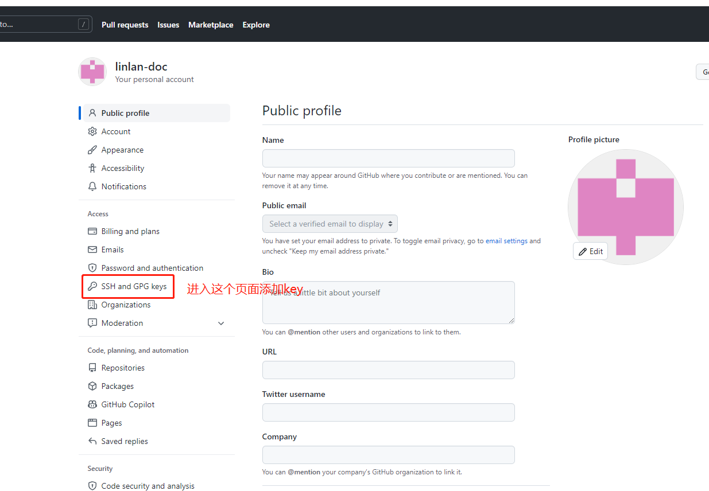

import Tabs from '@theme/Tabs';
import TabItem from '@theme/TabItem';

 [`Github`](https://github.com/)是风靡全球的代码托管平台，它托管了无数的开源项目，可以说是一个宝藏网站。

### 1. 账号申请

 前往官网申请账号即可，仅需要一个邮箱。

### 2. 添加ssh

 本地和服务器通过`ssh`协议进行通信，所以需要添加`ssh`，才可以向服务器推送代码。

#### 2.1 生成ssh key

<Tabs groupId="operating-systems">
  <TabItem value="windows" label="windows">

   先下载[`Git Bash`](https://git-scm.com/downloads)，打开`Git Bash`，执行以下命令，其中`ed25519`是`key`的类型，`ssh-keygen`支持的其他类型有:`dsa`、`ecdsa`、`esdsa-sk`、`rsa`等。后面邮箱用你注册`Github`的邮箱地址即可。

    ssh-keygen -t ed25519 -C "your_email@example.com"

 在生成的`key`的过程中，会提示你指定`key`名字，如果不指定，默认为`ed25519`。如果你打算生成多个`key`，就需要指定文件名称。  

 生成`key`之后，需要将`key`加入到`ssh-agent`里面，只有这样本地`ssh`在和`github`通信的时候，才知道用哪个`key`进行通信。第一条命令是启动`ssh-agent`，第二条命令是将生成的`key`添加到`ssh-agent`里面。

    eval "$(ssh-agent -s)"
    ssh-add ~/.ssh/id_ed25519

:::caution

 这里需要注意，`ssh-agent`不会自动启动。下次重启之后，又需要手动启动`ssh-agent`，并且添加文件，非常麻烦。这里可以在`C:\Users\tiago\.ssh`目录下，新增一个`config`文件，内容如下：

    Host *
      AddKeysToAgent yes
      IdentityFile ~/.ssh/id_ed25519

:::

 生成的`key`实际是一对，包括公钥和私钥，需要将公钥（`~/.ssh/id_ed25519.pub`文件里面的内容)添加到`github`的`SSH`里面。

  </TabItem>
  <TabItem value="mac" label="mac">

`Mac`的命令和`windows`的命令类似，一些参数的含义就不再赘述。

1.  生成`ssh key`

    ssh-keygen -t ed25519 -C "your_email@example.com"

2.  启动`ssh agent`

    eval "$(ssh-agent -s)"

3.  修改`~/.ssh/config`

 如果你系统版本高于`macOS Sierra 10.12.2`，你需要修改`~/.ssh/config`，打开`~/.ssh/config`，文件内容如下，如果你文件名称不是`id_ed25519`，需要修改成对应的文件名

    Host *
      AddKeysToAgent yes
      UseKeychain yes
      IdentityFile ~/.ssh/id_ed25519

4.  添加到`ssh agent`里

    ssh-add -K ~/.ssh/id_ed25519

  </TabItem>
  <TabItem value="linux" label="linux">

 `Linux`同前面两种操作系统，只列举命令

    ssh-keygen -t ed25519 -C "your_email@example.com"
    eval "$(ssh-agent -s)"
    ssh-add ~/.ssh/id_ed25519

  </TabItem>
</Tabs>

 这里简单介绍一下`ssh`的公钥认证的原理，在介绍它之前，需要先了解非对称加密算法，介绍非对称加密算法的文章很多，这里只需要知道非对称算法的几个特点：

1.  非对称算法有两个密钥，一个叫公钥，故名思意就是可以公开的密钥；一个是私钥，只有自己知道。
2.  对于用公钥进行加密的数据，只有通过私钥才能进行解密。
3.  用私钥对数据进行签名，可以用公钥来验证。

 公钥认证分为这样几个步骤：

1.  客户端先生成密钥对（例如前面使用`ssh-keygen`）
2.  将公钥拷贝到服务端（将`pub`文件添加到`github`)
3.  服务端将拷贝的公钥标记为信任的`key`
4.  服务端验证客户端是否拥有对应的私钥。

 验证的过程，`SSHV1`协议和`SSHV2`协议有一些差异：

`SSHV1`:

 服务端用公钥对一段数据进行加密，客户端收到之后，用私钥进行解密，并且返回给服务端这段数据的校验和。（利用非对称算法的第2点）

`SSHV2`:

 客户端对一段基于`sessionId`的数据进行签名，服务端接收到数据之后利用公钥来验证是否是对应私钥的签名。（利用非对称算法的第3点）

### 3. 新建仓库

 在`github`上点击创建仓库按钮，按照指引创建即可。

### 4. 将本地仓库推送到远端

#### 4.1 本地`git`仓库创建

 如果本地仓库已经存在，可以跳过。

    git init -b main
    git add .
    git commit -m "First commit"

#### 4.2 将本地仓库推送到远端

 执行以下命令，完成推送。

    git remote add origin  <REMOTE_URL>
    git remote -v
    git push origin main

> tips:`ssh key`已经添加，但还是提示没有权限，可以检查`ssh-agent`是否启动
