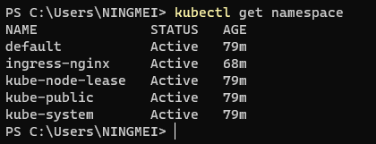
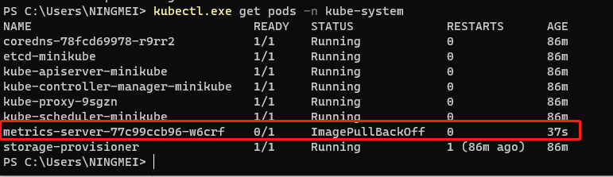
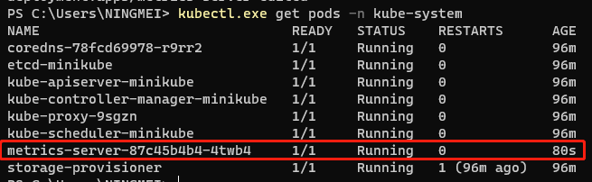
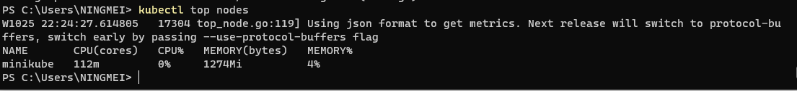

> minikube是单机版的k8s，方便学习和开发k8s

 在 _minikube_ 的官方案例中，使用了 _k8s.gcr.io_ 镜像。_gcr_ 是 _Google Cloud_ 的镜像仓库，所以国内是无法访问的。
阿里云的镜像代理地址为：_registry.aliyuncs.com/google_containers_，需要将 _gcr_ 的镜像地址替换为阿里云的地址，例如：_k8s.gcr.io/echoserver:1.4_ → _registry.aliyuncs.com/google_containers/echoserver:1.4_。

 _minikube_ 有非常多的插件，通过 _minikube addons list_ 可以查看插件列表，通过 _minikube addons enable xxx_ 可以启用 _xxx_ 插件。官方案例启动的是 _metrics server_，但该插件也是 _k8s.gcr.io_ 的镜像，所以无法正常运行，需要替换镜像地址。

 这里先介绍一下如何定位到镜像拉取失败。因为 _addons_ 并没有部署到默认空间，在 _k8s_ 里面，可以通过`kubectl get namespace`获取所有的命名空间。_metrics server_ 在 _kube-system_ 这个空间中，通过`kubectl get pods -n kube-system`可以看到 _metrics server_ 拉取镜像失败了。

 需要将 _metrics server_ 的镜像替换为阿里云的镜像，通过`kubectl edit deploy metrics-server -n kube-system`，可以修改它的镜像地址。国内的地址为 _registry.aliyuncs.com/google_containers/metrics-server:v0.4.2_，修改之后进行保存，再次使用`kubectl get pods -n kube-system`查看 _metrics server_ 容器的状态，发现在启动中。

 为了验证 _metrics server_ 是否启动完成，可以执行`kubectl top nodes`，可以查看 _k8s_ 集群资源的使用情况。

 _ingress_ 插件和 _metrics server_ 类似，也是镜像无法拉取。有点不同的是 _ingress_ 的命名空间是 _ingress-nginx_，如果要获取所有命名空间的 _pods_，可以使用 `kubectl get pods --all-namespaces`。很遗憾，在阿里云的镜像仓库，没有找到 _ingress_ 的镜像，只能使用代理了。

 笔者本机启动了一个 _http_ 代理，本地可以通过 _localhost:4567_ 访问。但 _minikube_ 是在容器里面拉取镜像，容器本身的 _localhost_ 并不是宿主机的 _localhost_。根据[官方文档](https://minikube.sigs.k8s.io/docs/handbook/host-access/)，_minikube_ 在 _v1.10_ 之后加入了`host.minikube.internal`用来访问宿主机的 _localhost_，最终使用以下命令启动 _minikube_，成功拉取到 _ingress_ 的镜像。

    minikube start --docker-env HTTP_PROXY=http://host.minikube.internal:10180 \
    --docker-env HTTPS_PROXY=http://host.minikube.internal:10180

:::tip

 搭建代理可以参考[海外建站全攻略](/docs/set-up-site/your-site-in-one)

:::
