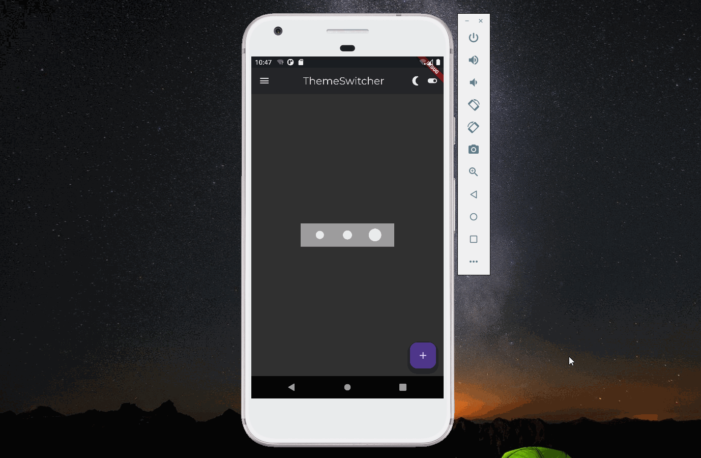

import Image from '@theme/IdealImage';

 越来越多的用户习惯睡觉前刷会手机，为了更好的保护视力，app支持用户开启夜间模式。安卓10开始支持夜间主题，当用户在手机设置里开启夜间主题后，应用能做对应的调整。本文介绍在应用内实现夜间模式切换，这点读者需要注意。

#### 1. ThemeData

 为了保证设计风格的一致，需要统一定义颜色、样式、字体等，_flutter_ 里使用 _ThemeData_ 来实现上述功能。`MaterialApp`的构造函数中，可以指定 _theme_ 字段来设置应用的主题。

    MaterialApp(
      title: appName,
      theme: ThemeData(
        // Define the default brightness and colors.
        brightness: Brightness.dark,
        primaryColor: Colors.lightBlue[800],
        // Define the default font family.
        fontFamily: 'Georgia',
      ),
      home: const MyHomePage(
        title: appName,
      ),
    );

#### 2. Material Design

 [Material Design](https://material.io/design)是 _Google_ 公司开发的一套设计标准，目前最新版本为 _Material Design 3_。相信很多读者并没有设计能力，而夜间模式是需要修改很多颜色的。[Material Theme Builder](https://m3.material.io/theme-builder#/dynamic)提供了主题设计器，并且支持导出，大大的造福切图工程师。

<Image img={require('./asserts/flutter3.png')} alt="导出Theme" />  

 本文导出的样式如下，它包含了两个 _Color Scheme_：一个正常模式，一个夜间模式。

    const lightColorScheme = ColorScheme(
      brightness: Brightness.light,
      surfaceTint: Color(0xFF6750A4),
      onErrorContainer: Color(0xFF410E0B),
      onError: Color(0xFFFFFFFF),
      errorContainer: Color(0xFFF9DEDC),
      onTertiaryContainer: Color(0xFF31111D),
      onTertiary: Color(0xFFFFFFFF),
      tertiaryContainer: Color(0xFFFFD8E4),
      tertiary: Color(0xFF7D5260),
      shadow: Color(0xFF000000),
      error: Color(0xFFB3261E),
      outline: Color(0xFF79747E),
      onBackground: Color(0xFF1C1B1F),
      background: Color(0xFFFFFBFE),
      onInverseSurface: Color(0xFFF4EFF4),
      inverseSurface: Color(0xFF313033),
      onSurfaceVariant: Color(0xFF49454F),
      onSurface: Color(0xFF1C1B1F),
      surfaceVariant: Color(0xFFE7E0EC),
      surface: Color(0xFFFFFBFE),
      onSecondaryContainer: Color(0xFF1D192B),
      onSecondary: Color(0xFFFFFFFF),
      secondaryContainer: Color(0xFFE8DEF8),
      secondary: Color(0xFF625B71),
      inversePrimary: Color(0xFFD0BCFF),
      onPrimaryContainer: Color(0xFF21005D),
      onPrimary: Color(0xFFFFFFFF),
      primaryContainer: Color(0xFFEADDFF),
      primary: Color(0xFF6750A4),
    );

    const darkColorScheme = ColorScheme(
      brightness: Brightness.dark,
      surfaceTint: Color(0xFFD0BCFF),
      onErrorContainer: Color(0xFFF2B8B5),
      onError: Color(0xFF601410),
      errorContainer: Color(0xFF8C1D18),
      onTertiaryContainer: Color(0xFFFFD8E4),
      onTertiary: Color(0xFF492532),
      tertiaryContainer: Color(0xFF633B48),
      tertiary: Color(0xFFEFB8C8),
      shadow: Color(0xFF000000),
      error: Color(0xFFF2B8B5),
      outline: Color(0xFF938F99),
      onBackground: Color(0xFFE6E1E5),
      background: Color(0xFF1C1B1F),
      onInverseSurface: Color(0xFF313033),
      inverseSurface: Color(0xFFE6E1E5),
      onSurfaceVariant: Color(0xFFCAC4D0),
      onSurface: Color(0xFFE6E1E5),
      surfaceVariant: Color(0xFF49454F),
      surface: Color(0xFF1C1B1F),
      onSecondaryContainer: Color(0xFFE8DEF8),
      onSecondary: Color(0xFF332D41),
      secondaryContainer: Color(0xFF4A4458),
      secondary: Color(0xFFCCC2DC),
      inversePrimary: Color(0xFF6750A4),
      onPrimaryContainer: Color(0xFFEADDFF),
      onPrimary: Color(0xFF381E72),
      primaryContainer: Color(0xFF4F378B),
      primary: Color(0xFFD0BCFF),
    );

#### 3. cubit

 当点击主题切换按钮时，整个应用需要重新渲染。如果不借助 _bloc_ 或者 _provider_ 这样的库，需要在 _Material App_ 这一层定义修改主题的方法，然后将这个方法以参数的形式传给主题切换的按钮。如果主题切换的按钮是 _Material App_ 的子组件，情况还比较可控，如果不是，那需要一层一层传递，代码将变得非常难维护。

 本文使用 _bloc_ 来实现按钮状态传递，对 _bloc_ 不是很熟悉的读者可以参考之前的[文章](../bloc/bloc.md)。

 _cubit_ 的逻辑比较简单，主题切换只有两个状态：1表示夜间模式开启，0表示夜间模式关闭。

    import 'package:bloc/bloc.dart';
    import 'package:meta/meta.dart';

    class ThemeChangeCubit extends Cubit<int> {
      //0表示 dark mode close,1表示 dark mode open。默认情况下时light mode
      ThemeChangeCubit() : super(0);
      //light mode 和dark mode 切换
      toggle() => emit(1 - state);
    }

#### 4. 完整代码

 整个夜间模式切换的代码如下，_Material App_ 是 _bloc_ 的根，`theme`字段会根据 _cubit_ 的状态来决定使用哪个 _Color Scheme_ 。页面模式切换的 _icon_ 也会根据状态进行对应的切换：当夜间模式打开时，展示已开启的 _icon_ ，当夜间模式关闭时，展示已关闭的 _icon_ 。

    import 'dart:math';

    import 'package:flutter/material.dart';
    import 'package:flutter_application_1/cubit/theme_change_cubit.dart';
    import 'package:flutter_application_1/theme/color_schemes.g.dart';
    import 'package:google_fonts/google_fonts.dart';
    import 'package:flutter_bloc/flutter_bloc.dart';

    void main(List<String> args) {
      runApp(const MyApp());
    }

    class MyApp extends StatelessWidget {
      const MyApp({Key? key}) : super(key: key);

      @override
      Widget build(BuildContext context) {
        return BlocProvider(
          create: (context) => ThemeChangeCubit(),
          child: BlocBuilder<ThemeChangeCubit, int>(
            builder: (inner, state) {
              return MaterialApp(
                theme: ThemeData(
                    useMaterial3: true,
                    colorScheme: state == 1 ? darkColorScheme : lightColorScheme),
                title: "my-app",
                home: const HomePage(),
              );
            },
          ),
        );
      }
    }

    class HomePage extends StatelessWidget {
      const HomePage({Key? key}) : super(key: key);

      @override
      Widget build(BuildContext context) {
        return Scaffold(
          appBar: AppBar(
            elevation: 2,
            title: Center(
              child: Text(
                "ThemeSwitcher",
                style: GoogleFonts.montserrat(),
              ),
            ),
            leading: IconButton(
              icon: const Icon(Icons.menu),
              onPressed: () {},
            ),
            actions: [
              BlocBuilder<ThemeChangeCubit, int>(
                builder: (context, state) {
                  return state == 1
                      ? const Icon(Icons.nightlight_round)
                      : const Icon(Icons.wb_sunny);
                },
              ),
              BlocBuilder<ThemeChangeCubit, int>(
                builder: (context, state) {
                  return state == 1
                      ? IconButton(
                          onPressed: () {
                            context.read<ThemeChangeCubit>().toggle();
                          },
                          icon: const Icon(Icons.toggle_on))
                      : IconButton(
                          onPressed: () {
                            context.read<ThemeChangeCubit>().toggle();
                          },
                          icon: const Icon(Icons.toggle_off));
                },
              )
            ],
          ),
          body: const Center(child: CircleLoader()),
          floatingActionButton: FloatingActionButton(
            onPressed: (() {}),
            child: const Icon(Icons.add),
          ),
        );
      }
    }

    class CircleLoader extends StatefulWidget {
      const CircleLoader({Key? key}) : super(key: key);

      @override
      _CircleLoaderState createState() => _CircleLoaderState();
    }

    class _CircleLoaderState extends State<CircleLoader>
        with SingleTickerProviderStateMixin {
      late AnimationController _controller;

      @override
      initState() {
        super.initState();
        _controller = AnimationController(
          vsync: this,
          duration: const Duration(seconds: 2),
        )..repeat();
      }

      @override
      dispose() {
        _controller.dispose();
        super.dispose();
      }

      buildCircle(double delay) {
        return ScaleTransition(
          scale: TestTween(begin: .85, end: 1.5, delay: delay).animate(_controller),
          child: Padding(
            padding: const EdgeInsets.all(8.0),
            child: Container(
              height: 20.0,
              width: 20.0,
              decoration: BoxDecoration(
                shape: BoxShape.circle,
                color: Colors.grey[300],
              ),
            ),
          ),
        );
      }

      @override
      Widget build(BuildContext context) {
        return Center(
          child: Container(
            width: 200.0,
            height: 50.0,
            color: Colors.grey,
            child: Row(
              mainAxisAlignment: MainAxisAlignment.spaceEvenly,
              children: <Widget>[
                buildCircle(.0),
                buildCircle(.2),
                buildCircle(.4),
              ],
            ),
          ),
        );
      }
    }

    class TestTween extends Tween<double> {
      final double delay;

      TestTween({required double begin, required double end, required this.delay})
          : super(begin: begin, end: end);

      @override
      double lerp(double t) {
        return super.lerp((sin((t - delay) * 2 * pi) + 1) / 2);
      }
    }

#### 5. 总结

  _Material App_ 的构造函数中 _darkTheme_ 字段用来指定夜间模式使用的主题，这是响应系统修改时的参数，感兴趣的读者可以自己进行尝试。

* * *

1.  [Material Design 3](https://m3.material.io/)

[署名-非商业性使用-禁止演绎 4.0 国际](https://creativecommons.org/licenses/by-nc-nd/4.0/deed.zh)
