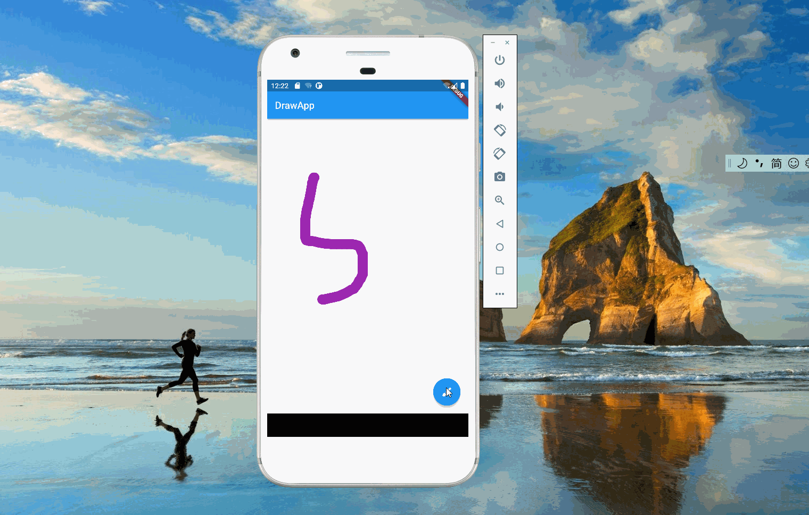

import Image from '@theme/IdealImage';

> 源码地址：<https://github.com/linlan-doc/draw_app_bloc>

 [画图应用实战：菜单](./selection-icon.md)一文介绍了画图应用菜单的设计，本文介绍画板的内容。

### 1. 画板的逻辑

 当用户按住屏幕，滑动鼠标或者手指时，画板会绘制出用户移动的轨迹。上述逻辑可以拆解为：画板监听用户的行为，当用户按住屏幕时，准备绘制线条；当用户移动时，每移动到一个新点，就绘制一条从上个点到新点的线；当用户停止时，绘制也停止。这里线条(_Stroke_)的起点是用户按下屏幕的地方，终点是用户释放的地方，它由一条条两点之间的线(_Line_)构成。系统需要记录所有用户绘制的线条(_Stroke_)，画板每次会重新渲染这些线条。

### 2. 线条定义

 线条描述了一系列的点的集合，这些点的连线就构成了线条。因为系统允许用户修改线条的颜色和直径，所以线条里定义了`color`和`strokeWidth`。

    class PaintStroke {
      final Color color;
      final double strokeWidth;
      //线条里面包含很多点
      final List<Offset> paintedPoint;

      const PaintStroke(this.color, this.strokeWidth, this.paintedPoint);
    }

### 3. bloc定义

 和画板菜单一样，画板也采用 _bloc_ 来管理状态。_cubit_ 定义如下，`onPanDown`表示用户按下屏幕，这时会准备新的线条(_Stroke_)。`onPanUpdate`表示用户在移动，这时将点加入到当前正在画的线条中。

    import 'dart:math';

    import 'package:bloc/bloc.dart';
    import 'package:draw_app_bloc/models/paint_stroker.dart';
    import 'package:flutter/material.dart';

    part 'paint_stroke_state.dart';

    class PaintStrokeCubit extends Cubit<PaintStrokeState> {
      PaintStrokeCubit()
          : super(const NormalPaintStrokeState([], Colors.pink, 10.0));

      changeColor(Color c) =>
          emit(UnPaintStrokeState(state.strokes, c, state.currentWidth));

      changeWidth(double width) =>
          emit(UnPaintStrokeState(state.strokes, state.currentColor, width));

      //新的stroke
      onPanDown(Offset offset) {
        PaintStroke p =
            PaintStroke(state.currentColor, state.currentWidth, [offset]);
        emit(NormalPaintStrokeState(
            [...state.strokes, p], state.currentColor, state.currentWidth));
      }

      //往最后一个stroke里添加点
      onPanUpdate(Offset offset) {
        state.strokes[state.strokes.length - 1].paintedPoint.add(offset);
        emit(NormalPaintStrokeState(
            state.strokes, state.currentColor, state.currentWidth));
      }

      //清除所有线条
      clearBoard() =>
          emit(NormalPaintStrokeState([], state.currentColor, state.currentWidth));
    }

 _state_ 的定义如下,`currentColor`和`currentWidth`表示当前画笔的颜色和线条的直径，菜单修改会反应到这两个变量上。新线条生成时会取`currentColor`和`currentWidth`。

 `UnPaintStrokeState`针对修改颜色和修改画笔直径，这两种事件不需要重新绘制画板，所以画板接受到 _state_ 后，会过滤掉`UnPaintStrokeState`。

 这里需要实现`==`，因为 _bloc_ 在`emit`时，会判断前后两个 _state_ 是否相等，如果相等就不会传递。

    class PaintStrokeState {
      const PaintStrokeState(this.strokes, this.currentColor, this.currentWidth);

    //所有的线条
      final List<PaintStroke> strokes;
      //当前的颜色
      final Color currentColor;
      //当前线条的直径
      final double currentWidth;

    //bloc的emit方法会对比前后两个状态，除非全部深拷贝，否则前后两次会相等
      @override
      bool operator ==(Object other) => false;
    }

    //修改颜色或者线条的状态
    class UnPaintStrokeState extends PaintStrokeState {
      const UnPaintStrokeState(
          super.stokes, super.currentColor, super.currentWidth);
    }

    class NormalPaintStrokeState extends PaintStrokeState {
      const NormalPaintStrokeState(
          super.stokes, super.currentColor, super.currentWidth);
    }

### 4. 绘画器

 接下来介绍如何将线条(_Stroke_)绘制在屏幕上。在 _flutter_ 里，通过继承`CustomPainter`，可以实现用户自定义画图。`StrokePainter`定义了`paintState`，接受的是 _bloc_ 的绘制状态。绘制时，遍历所有线条(_Stroke_)，将线条里的所有点用线(_Line_)连接起来，注意最后一个点因为没有后续，单独绘制一个点即可。

    class StrokePainter extends CustomPainter {
      PaintStrokeState paintState;
      StrokePainter(this.paintState);
      @override
      void paint(Canvas canvas, Size size) {
        final paint = Paint();
        for (PaintStroke st in paintState.strokes) {
          paint.color = st.color;
          paint.strokeWidth = st.strokeWidth;
          paint.strokeCap = StrokeCap.round;

          for (int i = 0; i < st.paintedPoint.length - 1; i++) {
            canvas.drawLine(st.paintedPoint[i], st.paintedPoint[i + 1], paint);
          }
          canvas.drawPoints(PointMode.points,
              [st.paintedPoint[st.paintedPoint.length - 1]], paint);
        }
      }

      @override
      bool shouldRepaint(covariant CustomPainter oldDelegate) {
        return true;
      }
    }

### 5. 监听用户行为

 _flutter_ 提供了`GestureDetector`来捕获用户的行为，画图场景关注两个事件`onPanDown`和`onPanUpdate`，对应 _bloc_ 里的两个方法。

    GestureDetector(
                    onPanDown: (details) {
                      context.read<ShowDrawingCubit>().closeOption();
                      context
                          .read<PaintStrokeCubit>()
                          .onPanDown(details.localPosition);
                    },
                    onPanUpdate: (details) => context
                        .read<PaintStrokeCubit>()
                        .onPanUpdate(details.localPosition),
                    child: const LocalPainter(Colors.white),
                  )

[署名-非商业性使用-禁止演绎 4.0 国际](https://creativecommons.org/licenses/by-nc-nd/4.0/deed.zh)
