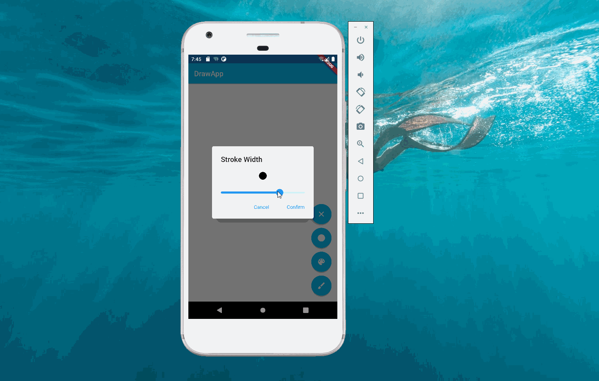
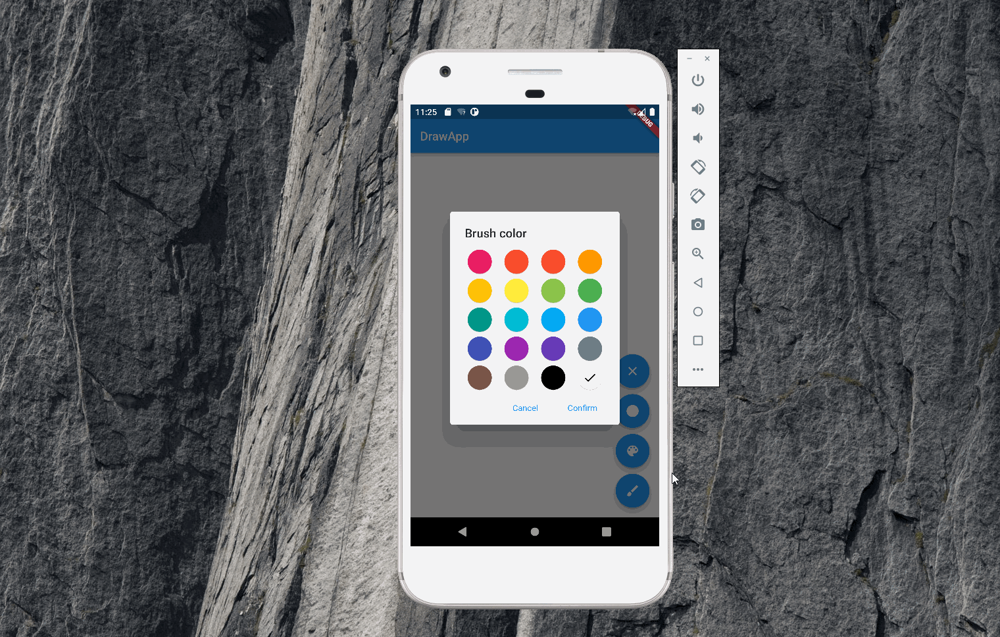

import Image from '@theme/IdealImage';

 画图应用实战系列基于[DrawApp](https://github.com/soupjake/drawapp)的源代码，介绍如何从0到1构建画图应用，源代码[地址](https://github.com/linlan-doc/draw_app_bloc)。

### 1. 初始化项目

 在 _Vs Code_ 中，通过命令面板里的 _Flutter Init_ 命令完成项目初始化。

### 2. 项目结构

 好的项目结构可以让代码更清晰，更利于团队协同。在 _lib_ 目录下新建了以下几个目录：

1.  _models_ : 用来放模型。
2.  _views_ : 用来放页面。
3.  _cubit_ : [bloc](../bloc/bloc.md)

 基本的调用关系：`main`→`DrawApp`→`DrawPage`，这样渲染的逻辑放在`DrawPage`里。

### 3. 菜单逻辑

 画图应用里菜单有4个按钮，分别是：

1.  清理画板：点击之后清空画板里的内容。
2.  设置线条：点击之后弹出设置线条的对话框。
3.  设置颜色：点击之后弹出设置颜色的对话框。
4.  显示/关闭选项：点击之后，如果前3个按钮已经隐藏，则显示前3个按钮；如果前3个按钮已经显示，则隐藏前3个按钮。

### 4. 显示/关闭选项

 第四个按钮——显示/关闭选项——的逻辑最为简单，新建一个`ShowDrawingCubit`。它的状态是0和1，0表示隐藏前3个按钮，1表示显示前3个按钮。

    import 'package:bloc/bloc.dart';

    class ShowDrawingCubit extends Cubit<int> {
      ShowDrawingCubit() : super(0);

      showDrawingOptionClick() {
        emit(1 - state);
      }
    }

 `DrawOption`用来渲染画图应用的选项，通过判断`ShowDrawingCubit`的状态来决定是否显示前三个按钮。

    import 'package:draw_app_bloc/cubit/show_drawing_cubit.dart';
    import 'package:flutter/material.dart';
    import 'package:flutter_bloc/flutter_bloc.dart';

    class DrawingOption extends StatelessWidget {
      const DrawingOption({Key? key}) : super(key: key);

      @override
      Widget build(BuildContext context) {
        return BlocBuilder<ShowDrawingCubit, int>(builder: (context, state) {
          //show icons
          if (state == 1) {
            return Column(
              mainAxisAlignment: MainAxisAlignment.end,
              crossAxisAlignment: CrossAxisAlignment.end,
              children: <Widget>[
                Padding(
                  padding: const EdgeInsets.only(bottom: 10),
                  child: FloatingActionButton(
                    onPressed: () => {},
                    child: const Icon(Icons.clear),
                  ),
                ),
                Padding(
                  padding: const EdgeInsets.only(bottom: 10),
                  child: FloatingActionButton(
                    onPressed: () => {},
                    child: const Icon(Icons.lens),
                  ),
                ),
                Padding(
                  padding: const EdgeInsets.only(bottom: 10),
                  child: FloatingActionButton(
                    onPressed: () => {},
                    child: const Icon(Icons.color_lens),
                  ),
                ),
                FloatingActionButton(
                  onPressed: () =>
                      context.read<ShowDrawingCubit>().showDrawingOptionClick(),
                  child: const Icon(Icons.brush),
                )
              ],
            );
          } else {
            return Column(
              mainAxisAlignment: MainAxisAlignment.end,
              crossAxisAlignment: CrossAxisAlignment.end,
              children: <Widget>[
                FloatingActionButton(
                  onPressed: () =>
                      context.read<ShowDrawingCubit>().showDrawingOptionClick(),
                  child: const Icon(Icons.brush),
                )
              ],
            );
          }
        });
      }
    }

#### 4.1 设置动画

 画图选项的显示和关闭需要添加动画过渡才自然。为了更好的动画效果，我们将最后一个按钮和前三个按钮分开。当显示按钮时，从空的 _Cloumn_ 过渡为包含三个 _Icon_ 的 _Column_；当隐藏按钮时，从包含三个 _Icon_ 的 _Cloumn_ 过渡到空的 _Column_ 。

 动画使用[AnimatedSwitcher](https://api.flutter.dev/flutter/widgets/AnimatedSwitcher-class.html)实现。当 _AnimatedSwitcher_ 的 _child_ 发生变化时，动画生效。注意 _child_ 需要指定不同的`key`，这样才会认为 _child_ 发生变化。

    class DrawingOptionColumn extends StatelessWidget {
      const DrawingOptionColumn({Key? key}) : super(key: key);

      @override
      Widget build(BuildContext context) {
        return BlocBuilder<ShowDrawingCubit, int>(builder: (context, state) {
          return Column(
            mainAxisAlignment: MainAxisAlignment.end,
            crossAxisAlignment: CrossAxisAlignment.end,
            children: [
              AnimatedSwitcher(
                duration: const Duration(milliseconds: 500),
                switchInCurve: Curves.easeInSine,
                child: state == 1
                    ? Column(
                        key: const Key("option_show"),
                        children: [
                          Padding(
                            padding: const EdgeInsets.only(bottom: 10),
                            child: FloatingActionButton(
                              onPressed: () => {},
                              child: const Icon(Icons.clear),
                            ),
                          ),
                          const StokeWidthOption(),
                          const ColorOption(),
                        ],
                      )
                    : Column(
                        key: const Key("option_hide"),
                      ),
              ),
              FloatingActionButton(
                onPressed: () =>
                    context.read<ShowDrawingCubit>().showDrawingOptionClick(),
                child: const Icon(Icons.brush),
              )
            ],
          );
        });
      }
    }

### 5. 设置线条

 设置线条的交互如下，拖动滑杆，滑杆上方的⚪会发生变化。点击确认按钮，对话框消失，同时将用户选择的线条大小传给画板。

 在设置线条的对话框里，需要一个 _cubit_，用来渲染滑杆上方的⚪。这个 _cubit_ 的状态是一个`double`类型，表示⚪的直径。它有一个`changeStroke`方法，弹出线条对话框以及滑杆拖动时会被调用。

    import 'package:bloc/bloc.dart';

    //设置线条对话框使用的cubit
    class StrokeWidthCubit extends Cubit<double> {
      StrokeWidthCubit() : super(1.0);

      changeStroke(double stokeWidth) => emit(stokeWidth);
    }

 对话框的代码如下，滑杆的`onChanged`方法触发时，会调用`StrokeWidthCubit`的`changeStroke`。同时，点击 _confirm_ 时，会将线条的直径传给`popup`方法。

    import 'package:draw_app_bloc/cubit/stroke_width_cubit.dart';
    import 'package:flutter/material.dart';
    import 'package:flutter_bloc/flutter_bloc.dart';

    class StrokeWidthDialog extends StatelessWidget {
      const StrokeWidthDialog({Key? key}) : super(key: key);

      @override
      Widget build(BuildContext context) {
        return BlocBuilder<StrokeWidthCubit, double>(
          builder: (context, state) {
            return SimpleDialog(
              title: const Text("Stroke Width"),
              children: [
                Container(
                    height: 45,
                    padding: const EdgeInsets.only(top: 5.0, bottom: 5.0),
                    child: Center(
                      child: Container(
                        width: state,
                        height: state,
                        decoration: const BoxDecoration(
                            color: Colors.black, shape: BoxShape.circle),
                      ),
                    )),
                Slider(
                  value: state,
                  min: 1.0,
                  max: 30.0,
                  onChanged: (d) {
                    context.read<StrokeWidthCubit>().changeStroke(d);
                  },
                ),
                Row(
                  mainAxisAlignment: MainAxisAlignment.end,
                  children: [
                    SimpleDialogOption(
                      onPressed: () => Navigator.pop(context),
                      child: const Text(
                        "Cancel",
                        style: TextStyle(color: Colors.blue),
                      ),
                    ),
                    SimpleDialogOption(
                      onPressed: () => Navigator.pop(
                          context, context.read<StrokeWidthCubit>().state),
                      child: const Text(
                        "Confirm",
                        style: TextStyle(color: Colors.blue),
                      ),
                    )
                  ],
                )
              ],
            );
          },
        );
      }
    }

### 6. 颜色画板

 颜色画板的交互比较简单，用户选择一个颜色之后，点击确认即可。

 这里为颜色选项定义了一个 _widget_，当某一个颜色的 _widget_ 被点击时，先判断和上一个 _widget_ 是否为同一个。如果是，则不处理；如果不是，则取消前一个的选中状态，将当前 _widget_ 置为选中。

#### 6.1 widget定义

 颜色 _widget_ 定义如下，它包含三个参数：`index`表示当前 _widget_ 的下标，消费 _bloc_ 的状态时，需要使用`index`判断当前 _widget_ 是否需要重新渲染；`color`表示当前 _widget_ 的背景色，即用户选中的画笔颜色；`selectedColor`表示用户选中后，✓的背景色。

    import 'package:draw_app_bloc/cubit/color_selection_cubit.dart';
    import 'package:flutter/material.dart';

    import 'package:flutter_bloc/flutter_bloc.dart';

    class ColorSelectionWidget extends StatelessWidget {
      final int index; //当前下标
      final Color color; //当前widget的背景颜色
      final Color
          selectedColor; //当前widget选中后，icon的颜色。只有黑色和白色的区别，如果widget背景色为亮色，则选中icon为黑色，反之为白色。
      const ColorSelectionWidget(
          {Key? key,
          required this.index,
          required this.color,
          required this.selectedColor})
          : super(key: key);
      @override
      Widget build(BuildContext context) {
        return FloatingActionButton(
            onPressed: () =>
                context.read<ColorSelectionCubit>().colorSelect(index, color),
            elevation: 1.0,
            backgroundColor: color,
            mini: true,
            child: BlocConsumer<ColorSelectionCubit, ColorSelectionState>(
              listener: (context, state) {},
              buildWhen: (previous, current) {
                //减少不必要的渲染，
                if (previous == current) {
                  return false;
                } else {
                  //只有当本次被选中，或者上次选中的widget才需要重新渲染
                  return previous.selectedIndex == index ||
                      current.selectedIndex == index;
                }
              },
              builder: (context, state) {
                return state.selectedIndex == index
                    ? Icon(
                        Icons.check,
                        color: selectedColor,
                      )
                    : Container();
              },
            ));
      }
    }

#### 6.2 bloc定义

 [bloc](../bloc/bloc.md)用来分离业务逻辑和 _ui_ 渲染。当色彩选项的 _widget_ 被点击之后，会通知 _bloc_ 被点击的 _widget_ 的下标，然后 _bloc_ 改变状态，通知监听状态变化的 _ui_ 重新渲染。

    @immutable
    class ColorSelectionState extends Equatable {
      final int selectedIndex;
      final Color color;
      const ColorSelectionState(this.selectedIndex, this.color);

      @override
      List<Object?> get props => [selectedIndex, color];
    }

 色彩选项的 _widget_ 在重新渲染时，加上了`buidWhen`：如果前后两次状态一致，那说明用户连续点击同一个 _widget_，这时 _widget_ 并不需要进行渲染；如果前后两次状态不一致，那也只有两个 _widget_ 需要重新渲染，前一个被选中的 _widget_ 需要隐藏✓,当前被选中的 _widget_ 需要显示✓。

[署名-非商业性使用-禁止演绎 4.0 国际](https://creativecommons.org/licenses/by-nc-nd/4.0/deed.zh)
