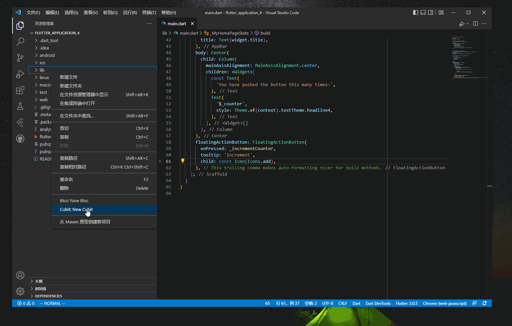

import Image from '@theme/IdealImage';

 如果你使用 _Vs Code_ 新建一个 _flutter_ 项目，你将得到经典的 _counter_ 项目，它的代码如下。

    import 'package:flutter/material.dart';

    void main() {
      runApp(const MyApp());
    }

    class MyApp extends StatelessWidget {
      const MyApp({Key? key}) : super(key: key);

      @override
      Widget build(BuildContext context) {
        return MaterialApp(
          title: 'Flutter Demo',
          theme: ThemeData(
            primarySwatch: Colors.blue,
          ),
          home: const MyHomePage(title: 'Flutter Demo Home Page'),
        );
      }
    }

    class MyHomePage extends StatefulWidget {
      const MyHomePage({Key? key, required this.title}) : super(key: key);
      final String title;
      @override
      State<MyHomePage> createState() => _MyHomePageState();
    }

    class _MyHomePageState extends State<MyHomePage> {
      int _counter = 0;

      void _incrementCounter() {
        setState(() {
          _counter++;
        });
      }

      @override
      Widget build(BuildContext context) {
        return Scaffold(
          appBar: AppBar(
            title: Text(widget.title),
          ),
          body: Center(
            child: Column(
              mainAxisAlignment: MainAxisAlignment.center,
              children: <Widget>[
                const Text(
                  'You have pushed the button this many times:',
                ),
                Text(
                  '$_counter',
                  style: Theme.of(context).textTheme.headline4,
                ),
              ],
            ),
          ),
          floatingActionButton: FloatingActionButton(
            onPressed: _incrementCounter,
            tooltip: 'Increment',
            child: const Icon(Icons.add),
          ), // This trailing comma makes auto-formatting nicer for build methods.
        );
      }
    }

 上面代码将 _ui_ 和业务逻辑放在一起，增加了维护成本和测试复杂度。_bloc_ 模式是为了实现 _ui_ 和业务逻辑解耦而设计的，它的全称为 _Business logic components_。[flutter_bloc](https://github.com/felangel/bloc)的原理如下：

<Image img={require('./asserts/flutter8.png')} alt="bloc原理" />  

-   _ui_ 捕获用户的动作，将动作传递给 _bloc_ 。_bloc_ 处理事件，更新状态，将状态传递给 _ui_，_ui_ 根据状态进行更新。

 接下来介绍如何使用 _bloc_ 改写上面 _counter_ 的例子。

#### 1. 添加依赖

  添加`flutter_bloc`到项目中

    dependencies:
      flutter_bloc: ^8.0.1

#### 2. 添加cubit

 _Cubit_ 是 _bloc_ 包提供的一个工具，它和 _bloc_ 非常相似，只是没有使用 _event_。如果你安装了[bloc](./flutter-extension)插件，可以右键 _lib_ 目录，选择 _New Cubit_。

 

 插件会在 _lib_ 目录下新建 _cubit_ 目录，目录里面有两个文件，一个是 _cubit_，一个是 _state_ 。_cubit_ 里面包含了业务逻辑，同时将新的状态同步给 _ui_。在 _counter_
例子中，只有一个整型的计数器，所以不需要定义 _state_。

    class CounterCubit extends Cubit<int> {
      CounterCubit() : super(0);

      increment() => emit(state + 1);
    }

 `CounterCubit`定义了`increment`方法，这个方法处理了业务逻辑之后，释放了新的`state`。

#### 3. 修改ui

    import 'package:flutter/material.dart';
    import 'package:flutter_application_4/cubit/counter_cubit.dart';
    import 'package:flutter_bloc/flutter_bloc.dart';

    void main() {
      runApp(const MyApp());
    }

    class MyApp extends StatelessWidget {
      const MyApp({Key? key}) : super(key: key);

      @override
      Widget build(BuildContext context) {
        return BlocProvider(
          create: (context) => CounterCubit(),
          child: MaterialApp(
            title: 'Flutter Demo',
            theme: ThemeData(
              primarySwatch: Colors.blue,
            ),
            home: const HomePage(),
          ),
        );
      }
    }

    class HomePage extends StatelessWidget {
      const HomePage({Key? key}) : super(key: key);

      @override
      Widget build(BuildContext context) {
        return Scaffold(
            appBar: AppBar(
              title: const Text('Title'),
            ),
            body: BlocBuilder<CounterCubit, int>(
              builder: (context, state) {
                return Center(child: Text('$state'));
              },
            ),
            floatingActionButton: FloatingActionButton(
              onPressed: () => context.read<CounterCubit>().increment(),
              tooltip: 'Increment',
              child: const Icon(Icons.add),
            ));
      }
    }

 _ui_ 代码如上，里面有两个重要的类：`BlocProvider`和`BlocBuilder`。

1.  `BlocProvider`:在 _bloc_ 原理中， _ui_ 接受了用户事件之后，需要将事件传递给 _bloc_。`BlocProvider`作为中间人，来实现这一功能。可以看到`onPressed`方法从上下文中读取出`CounterCubit`，然后调用它的`increment`方法，实现将用户的点击事件传递给 _bloc_ 。

2.  `BlocBuilder` 实际是一个 _Widget_ ，它接受 _bloc_ 释放的状态消息，更新 _ui_ 。

[署名-非商业性使用-禁止演绎 4.0 国际](https://creativecommons.org/licenses/by-nc-nd/4.0/deed.zh)
