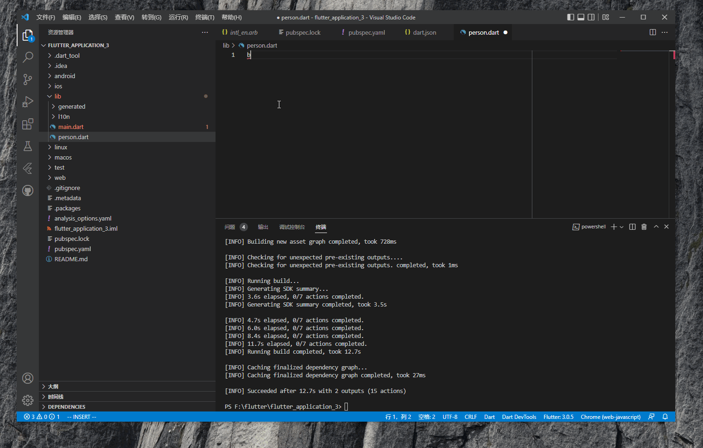
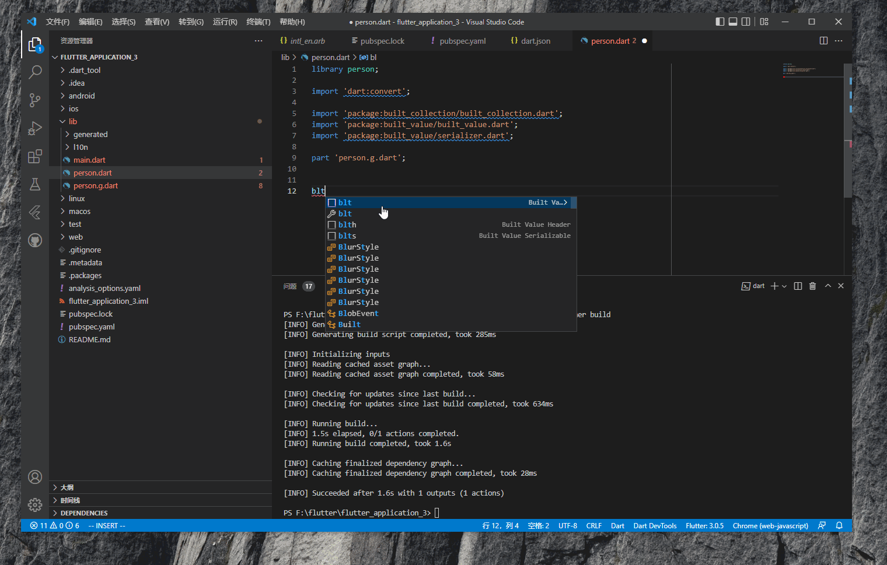
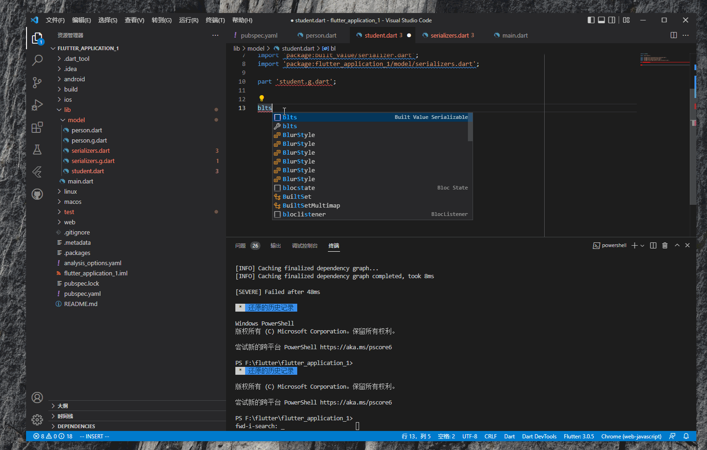

import Image from '@theme/IdealImage';

 实际开发过程中，不可避免的要和服务端进行数据交互。_json_ 是一种可读性强应用广泛的协议。_Java_ 语言中，有 _Gson_,_Jackson_,_fastjson_ 这样的序列化包，但 _Dart_ 里没有。这是因为这些包实现序列化依赖反射，而反射与缩小包体积的算法[tree shaking](https://en.wikipedia.org/wiki/Tree_shaking)相冲突。所以在 _Dart_ 里使用 _build_value_ 这样的工具生成序列化的代码。

#### 1.添加依赖

 _build_value_ 是一个三方包，和 _Java_ 里面的 _Lombok_ 有点类似，需要添加以下依赖。

    dependencies:
      built_collection: ^5.0.0
      built_value: ^8.4.0

    dev_dependencies:
      build_runner: ^1.0.0
      built_value_generator: ^8.4.0

#### 2. 配置Vs Code代码模板

 _build_value_ 会自动识别需要生成代码的类，这些类的格式固定。在 _Vs Code_ 里可以配置模板：文件→首选项→配置用户代码片段，搜索`dart.json`，将下面的内容拷贝进去。

    {
        "Built Value": {
            "prefix": "blt",
            "body": [
                "abstract class ${1} implements Built<${1}, ${1}Builder> {",
                "\t${0:// fields go here}",
                "",
                "\t${1}._();",
                "",
                "\tfactory ${1}([updates(${1}Builder b)]) = _$${1};",
                "}"
            ],
            "description": "Built Value Class"
        },
        "Built Value Serializable": {
            "prefix": "blts",
            "body": [
                "abstract class ${1} implements Built<${1}, ${1}Builder> {",
                "\t${0:// fields go here}",
                "",
                "\t${1}._();",
                "",
                "\tfactory ${1}([updates(${1}Builder b)]) = _$${1};",
                "",
                "\tString toJson() {",
                "\t\treturn json.encode(serializers.serializeWith(${1}.serializer, this));",
                "\t}",
                "",
                "\tstatic ${1}? fromJson(String jsonString) {",
                "\t\treturn serializers.deserializeWith(${1}.serializer, json.decode(jsonString));",
                "\t}",
                "",
                "\tstatic Serializer<${1}> get serializer => _$${1/(^[A-z]{1})/${1:/downcase}/}Serializer;",
                "}"
            ],
            "description": "Serializable Built Value Class"
        },
        "Built Value Header": {
            "prefix": "blth",
            "body": [
                "library ${1};",
                "",
                "import 'dart:convert';",
                "",
                "import 'package:built_collection/built_collection.dart';",
                "import 'package:built_value/built_value.dart';",
                "import 'package:built_value/serializer.dart';",
                "",
                "part '${1}.g.dart';",
            ],
            "description": "Built Value Imports and File Header"
        },
    }

#### 3. 编写代码

 新建一个 _person.dart_ 文件，输入`blth`，插件自动补充 _build_value_ 的头。

 输入`blt`会补充内容。

 执行命令`flutter packages pub run build_runner build`即可完成自动生成。此时目录下会多出一个 _person.g.dart_ 文件。

<Image img={require('./asserts/flutter7.png')} alt="buil value自动生成文件" /> 

:::tip

 _build_value_ 支持监控文件变化,自动生成代码。使用命令`flutter packages pub run build_runner watch`即可

:::

#### 4. builder使用

 这里定义了`person`类，它包含了两个属性：`name`和`address`。

    abstract class Person implements Built<Person, PersonBuilder> {
      // fields go here
      String get name;
      String get address;

      Person._();

      factory Person([updates(PersonBuilder b)]) = _$Person;
    }

 使用时，传入一个 _builder_ 到构造函数中。这里`..`被称为[级联操作符](https://dart.dev/guides/language/language-tour#cascade-notation)。

    Person p = Person((b) => b
        ..name = "lily"
        ..address = "jiangxi");

 如果 _builder_ 没有指定某个属性的值，此时程序会崩溃。需要在可以为空的属性前加上`?`。

    abstract class Person implements Built<Person, PersonBuilder> {
      // fields go here
      String? get name;
      String get address;

      Person._();

      factory Person([updates(PersonBuilder b)]) = _$Person;
    }

#### 5. rebuild生成新对象

 _build_value_ 没有 _setter_ 方法，如果想修改某些属性，可以使用`rebuild`方法重新生成一个对象。

    Person q = p.rebuild((b) => b..address = "sichuang");

#### 6. build collectoin使用

 当属性值为集合时，可以使用 _build_value_ 里的 _build collcetion_ 。定义属性类型时，需要指定集合，下面例子定义了`phones`这个 _list_ 和`bags`这个 _set_。

    abstract class Person implements Built<Person, PersonBuilder> {
      // fields go here
      String? get name;
      String get address;

      BuiltList<String> get phones;

      BuiltSet<String> get bags;

      Person._();

      factory Person([updates(PersonBuilder b)]) = _$Person;
    }

 使用时，可以向对应的集合添加所需的元素。

    Person p = Person((b) => b
        ..address = "jiangxi"
        ..name = "lily"
        ..bags.addAll(['bag1', 'bag2'])
        ..phones.addAll(['phone1', 'phone2']));

#### 7. serializer使用

 和前面类似，在_Vs code_ 里输入`blts`，插件就会自动补全代码。输入类名之后记得按下`tab`，这样`serializer`才会变成驼峰结构。

 接下来需要新建`serializers.dart`，和模型类似，先使用`blth`声明头信息。然后定义`serializer`。

    library serializers;

    import 'dart:convert';

    import 'package:built_collection/built_collection.dart';
    import 'package:built_value/built_value.dart';
    import 'package:built_value/serializer.dart';
    import 'package:flutter_application_1/model/student.dart';

    part 'serializers.g.dart';

    @SerializersFor([Student])
    final Serializers serializers = _$serializers;

 这时就可以在其他地方使用`toJson`和`fromJson`方法了。

    void main() {
      Student s = Student((b) => b
        ..name = "lily"
        ..address = "qinhai");
      print(s.toJson());
    }

<Image img={require('./asserts/flutter9.png')} alt="JSON的输出结果" /> 

#### 8. 使用标准json序列化

 细心的读者会发现，_build_value_ 序列化方式和标准的序列化方式不一样，可以修改`serializer`，使用标准的序列化方式。

    @SerializersFor([Student])
    final Serializers serializers =
        (_$serializers.toBuilder()..addPlugin(StandardJsonPlugin())).build();

* * *

1.  [Built Value Tutorial for Dart & Flutter](https://resocoder.com/2019/01/16/built-value-tutorial-for-dart-flutter/)

2.  [Youtube video](https://www.youtube.com/watch?v=Jji05a2GV_s&t=1029s)

3.  [JSON and serialization](https://docs.flutter.dev/development/data-and-backend/json)

[署名-非商业性使用-禁止演绎 4.0 国际](https://creativecommons.org/licenses/by-nc-nd/4.0/deed.zh)
