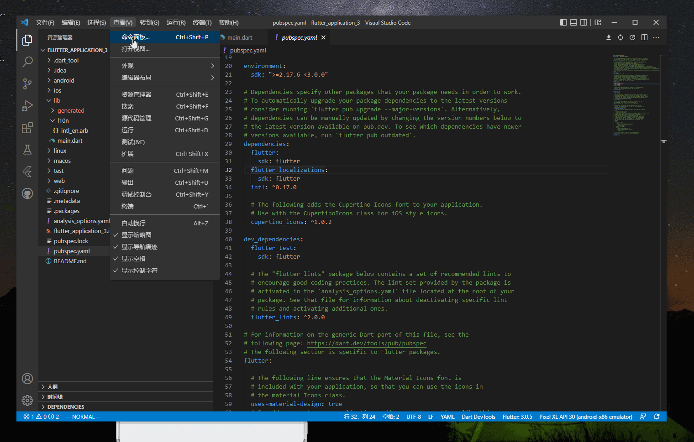

import Image from '@theme/IdealImage';

 如果你的用户来自不同的国家，那你需要做好多语种适配。_flutter_ 提供了一套多语种的解决方案，截至2020年11月，已经支持78种不同的语言。

### 1. 增加依赖

 在 _pubspec.yaml_ 文件中，增加以下内容。

    dependencies:
      flutter:
        sdk: flutter
      flutter_localizations:
        sdk: flutter
      intl: ^0.17.0 # Add this line

    # 这个不属于dependencies
    flutter:
      generate: true # Add this line

### 2. 添加l10n.yaml配置

 在项目根目录下，添加 _l10n.yaml_ 文件，同时加上以下内容。

    arb-dir: lib/l10n
    template-arb-file: app_en.arb
    output-localization-file: app_localizations.dart

### 3. 增加模板文件

 在 _lib_ 目录下新增 _i10n_ 文件夹，在 _i10n_ 文件夹下新增 _app_en.arb_ 文件，即 _i10n.yaml_ 里的`template-arb-file`。

    {
        "helloWorld": "Hello World!",
        "@helloWorld": {
          "description": "The conventional newborn programmer greeting"
        }
    }

 接下来新增 _app_zh.arb_ 文件，定义`helloWorld`对应的中文。

    {
        "helloWorld":"你好"
    }

 保存之后，在目录 _.dart_tool_ 里会生成 _flutter_gen_ 文件夹，里面包含了多语种的文件。

<Image img={require('./asserts/flutter6.png')} alt="生成的文件" /> 

### 4. 使用

 在`MaterialApp`里，声明支持的语言种类`supportedLocales`，设置`localizationsDelegates`，在需要使用多语种的地方使用`Text(AppLocalizations.of(context)!.helloWorld);`。如果提示无法找到`flutter_gen`包，可以尝试删除 _flutter_gen_ 文件夹。

    import 'package:flutter/material.dart';
    import 'package:flutter_localizations/flutter_localizations.dart';
    import 'package:flutter_gen/gen_l10n/app_localizations.dart';

    void main() {
      runApp(const MyApp());
    }

    class MyApp extends StatelessWidget {
      const MyApp({super.key});

      @override
      Widget build(BuildContext context) {
        const appTitle = 'Orientation Demo';

        return const MaterialApp(
            title: appTitle,
            localizationsDelegates: [
              GlobalMaterialLocalizations.delegate,
              GlobalWidgetsLocalizations.delegate,
              GlobalCupertinoLocalizations.delegate,
              AppLocalizations.delegate,
            ],
            supportedLocales: [
              Locale('en', ''), // English, no country code
              Locale('zh', ''), // Spanish, no country code
            ],
            home: HomeWidget());
      }
    }

    class HomeWidget extends StatelessWidget {
      const HomeWidget({Key? key}) : super(key: key);

      @override
      Widget build(BuildContext context) {
        return Scaffold(
          appBar: AppBar(title: Text(AppLocalizations.of(context)!.helloWorld)),
        );
      }
    }

:::caution

 如果在`MaterialApp`直接设置`home`属性返回`Scaffold`会报空指针。

    home: Scaffold(
        appBar: AppBar(title: Text(AppLocalizations.of(context)!.helloWorld)),
    ));

:::

### 5. 使用Flutter Intl插件

 [Flutter Intl](https://marketplace.visualstudio.com/items?itemName=localizely.flutter-intl)插件可以帮助开发者处理好多语种适配的问题，下面介绍一下如何使用这款插件。

#### 5.1 插件安装

 前往 _Vs Code_ 的插件市场，搜索 _Flutter Intl_。

#### 5.2 初始化项目

 查看→命名面板→Flutter Intl:Initialize，这时 _lib_ 文件夹下多生成 _l10n_ 和 _generated_ 两个文件夹。

#### 5.3 添加依赖

 和前面介绍的方式一样，需要修改 _pubspec.yaml_ 文件。

    dependencies:
      flutter:
        sdk: flutter
      flutter_localizations:
        sdk: flutter
      intl: ^0.17.0

#### 5.4 新增语言

 查看→命名面板→Flutter Intl:add locale，新增支持的语言。

#### 5.5 修改代码

 和前面类似，在创建`MaterialApp`时需要指定 _delegates_ 和支持的语言。`S`是插件生成的类名，待会还会用到。

    localizationsDelegates: const [
            S.delegate,
            GlobalMaterialLocalizations.delegate,
            GlobalWidgetsLocalizations.delegate,
            GlobalCupertinoLocalizations.delegate,
          ],
          supportedLocales: S.delegate.supportedLocales,

#### 5.6 提取需要翻译的内容到ARB文件

 选中需要翻译的文本，点击 _Extract to ARB_ 即可。这时，所有的语言都会加上需要翻译内容，开发者只需将不同语言的翻译填入即可。

* * *

1.  [Internationalizing Flutter apps](https://docs.flutter.dev/development/accessibility-and-localization/internationalization)

2.  [Flutter returns null for AppLocalization.of(context)](https://stackoverflow.com/questions/68884259/flutter-returns-null-for-applocalization-ofcontext)

[署名-非商业性使用-禁止演绎 4.0 国际](https://creativecommons.org/licenses/by-nc-nd/4.0/deed.zh)
