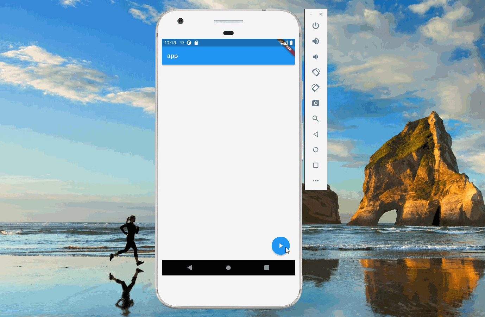

import Image from '@theme/IdealImage';

> 本文是Flutter动画系列的第八篇，建议读者阅读前面的教程，做到无缝衔接。

 当按钮被点击时，图标也需要相应的变化，例如播放——暂停这种场景。本文介绍如何在 _flutter_ 里实现图标切换的动画。

#### 1. AnimatedIcon

 _flutter_ 提供了`AnimatedIcon`类来实现图标的切换，它的构造函数如下，其中`icon`表示需要切换的图标，本文使用的是`AnimatedIcons.play_pause`，即播放和暂停组合；`progress`为动画参数。

    AnimatedIcon({Key? key, required AnimatedIconData icon, required Animation<double> progress, Color? color, double? size, String? semanticLabel, TextDirection? textDirection})

 完整的代码如下

    import 'package:flutter/material.dart';

    void main() => runApp(const MyApp());

    class MyApp extends StatelessWidget {
      const MyApp({Key? key}) : super(key: key);

      static const String _title = 'Flutter Code Sample';

      @override
      Widget build(BuildContext context) {
        return const MaterialApp(
          title: _title,
          home: MyStatefulWidget(),
        );
      }
    }

    class MyStatefulWidget extends StatefulWidget {
      const MyStatefulWidget({Key? key}) : super(key: key);

      @override
      State<MyStatefulWidget> createState() => _MyStatefulWidgetState();
    }

    class _MyStatefulWidgetState extends State<MyStatefulWidget>
        with TickerProviderStateMixin {
      late AnimationController controller;

      @override
      void initState() {
        super.initState();
        controller =
            AnimationController(vsync: this, duration: const Duration(seconds: 1));
      }

      @override
      void dispose() {
        controller.dispose();
        super.dispose();
      }

      @override
      Widget build(BuildContext context) {
        return Scaffold(
          appBar: AppBar(
            title: const Text("app"),
          ),
          body: const Center(),
          floatingActionButton: FloatingActionButton(
            onPressed: () {
              if (controller.isDismissed) {
                controller.forward();
              } else {
                controller.reverse();
              }
            },
            child:
                AnimatedIcon(icon: AnimatedIcons.play_pause, progress: controller),
          ),
        );
      }
    }

### 2. AnimatedCrossFade

 `AnimatedIcons`提供的组合比较有限，有时无法满足需求。同时 _flutter_ 没有提供类似`ColorTween`这样的类来实现图标切换，所以我们只能借助其他的类。

 `AnimatedCrossFade`是 _flutter_ 提供的动画类，它的构造函数如下。`AnimatedCrossFade`用来实现两个子组件间的切换动画，`firstChild`和`secondChild`分别指两个子组件，只要指定这两个组件为图标，就可以实现图标切换的动画。

    AnimatedCrossFade({Key? key, required Widget firstChild, required Widget secondChild, Curve firstCurve = Curves.linear, Curve secondCurve = Curves.linear, Curve sizeCurve = Curves.linear, AlignmentGeometry alignment = Alignment.topCenter, required CrossFadeState crossFadeState, required Duration duration, Duration? reverseDuration, AnimatedCrossFadeBuilder layoutBuilder = defaultLayoutBuilder, bool excludeBottomFocus = true})

 `crossFadeState`用来表示动画结束时，展示哪个子组件。在`AnimatedCrossFade`重新渲染时，它会判断`crossFadeState`是否发生变化，如果发生变化就会触发动画。所以我们只需要控制`crossFadeState`即可，完整的代码如下。

    import 'package:flutter/material.dart';

    void main() => runApp(const MyApp());

    class MyApp extends StatelessWidget {
      const MyApp({Key? key}) : super(key: key);

      static const String _title = 'Flutter Code Sample';

      @override
      Widget build(BuildContext context) {
        return const MaterialApp(
          title: _title,
          home: MyStatefulWidget(),
        );
      }
    }

    class MyStatefulWidget extends StatefulWidget {
      const MyStatefulWidget({Key? key}) : super(key: key);

      @override
      State<MyStatefulWidget> createState() => _MyStatefulWidgetState();
    }

    class _MyStatefulWidgetState extends State<MyStatefulWidget>
        with TickerProviderStateMixin {
      bool first = true;

      @override
      Widget build(BuildContext context) {
        return Scaffold(
          appBar: AppBar(
            title: const Text("app"),
          ),
          body: const Center(),
          floatingActionButton: FloatingActionButton(
            onPressed: () {
              setState(() {
                first = !first;
              });
            },
            child: AnimatedCrossFade(
                firstChild: const Icon(Icons.ac_unit),
                secondChild: const Icon(Icons.access_alarm),
                crossFadeState:
                    first ? CrossFadeState.showFirst : CrossFadeState.showSecond,
                duration: const Duration(seconds: 1)),
          ),
        );
      }
    }

 `AnimatedCrossFade`的参数还有很多，它支持设置第一个子组件消失时的 _curve_，也支持第二个组件消失时的 _curve_ 等，感兴趣的读者可以自行尝试。

### 3. AnimatedSwitcher

 `AnimatedSwitcher`和`AnimatedCrossFade`非常类似，当`AnimatedSwitcher`的子组件发生变化时会使用动画进行过渡。`AnimatedSwitcher`的构造函数如下，`child`表示它的子组件，当`AnimatedSwitcher`重新渲染时，如果子组件发生变化时，会使用 _cross-fade_ 进行过渡，当然用户可以通过参数`transitionBuilder`修改过渡方式。

    AnimatedSwitcher({Key? key, Widget? child, required Duration duration, Duration? reverseDuration, Curve switchInCurve = Curves.linear, Curve switchOutCurve = Curves.linear, AnimatedSwitcherTransitionBuilder transitionBuilder = AnimatedSwitcher.defaultTransitionBuilder, AnimatedSwitcherLayoutBuilder layoutBuilder = AnimatedSwitcher.defaultLayoutBuilder})

 完整的代码如下，需要注意的是，`AnimatedSwitcher`通过子组件的 _key_ 来判断组件是否发生变化。

    import 'package:flutter/material.dart';

    void main() => runApp(const MyApp());

    class MyApp extends StatelessWidget {
      const MyApp({Key? key}) : super(key: key);

      static const String _title = 'Flutter Code Sample';

      @override
      Widget build(BuildContext context) {
        return const MaterialApp(
          title: _title,
          home: MyStatefulWidget(),
        );
      }
    }

    class MyStatefulWidget extends StatefulWidget {
      const MyStatefulWidget({Key? key}) : super(key: key);

      @override
      State<MyStatefulWidget> createState() => _MyStatefulWidgetState();
    }

    class _MyStatefulWidgetState extends State<MyStatefulWidget>
        with TickerProviderStateMixin {
      bool first = true;

      @override
      Widget build(BuildContext context) {
        return Scaffold(
          appBar: AppBar(
            title: const Text("app"),
          ),
          body: const Center(),
          floatingActionButton: FloatingActionButton(
            onPressed: () {
              setState(() {
                first = !first;
              });
            },
            child: AnimatedSwitcher(
              duration: const Duration(seconds: 1),
              reverseDuration: const Duration(seconds: 5),
              child: first
                  ? const Icon(
                      Icons.play_arrow,
                      key: Key("play_icon"),
                    )
                  : const Icon(
                      Icons.stop_circle,
                      key: Key("stop_icon"),
                    ),
            ),
          ),
        );
      }
    }

[署名-非商业性使用-禁止演绎 4.0 国际](https://creativecommons.org/licenses/by-nc-nd/4.0/deed.zh)
