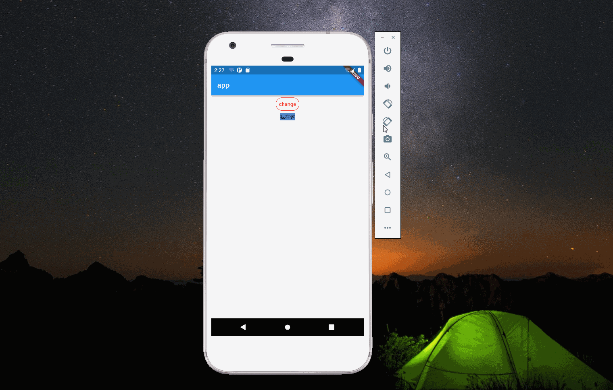
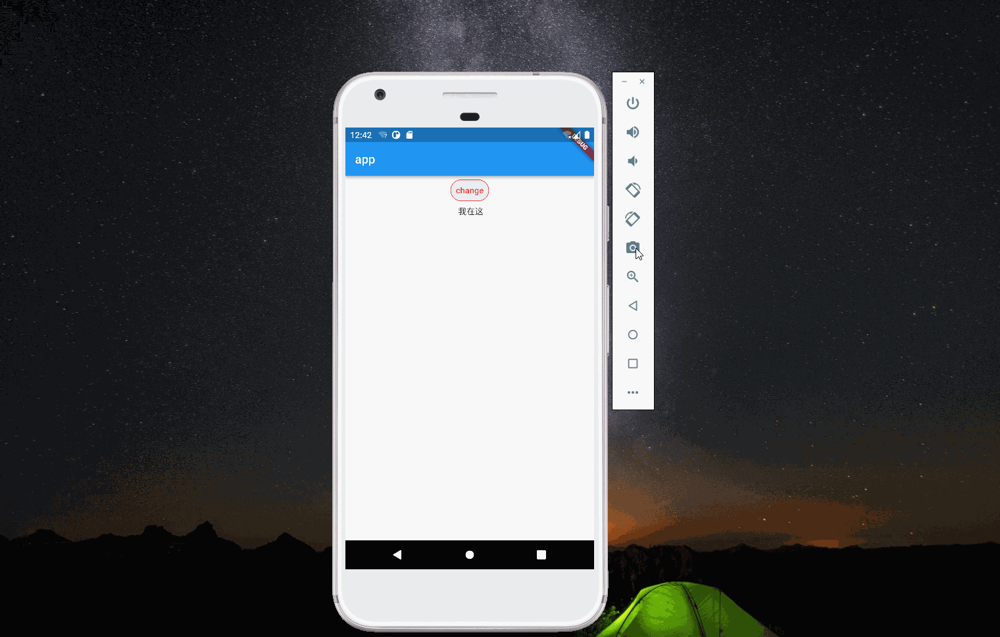

import Image from '@theme/IdealImage';

> 本文是Flutter动画系列的第三篇，建议读者阅读前面的教程，做到无缝衔接。

 除了动画组件，_flutter_ 还提供了灵活性更强的类：`AnimationControler`，本文介绍`AnimationControler`的使用。

### 1. flutter里的动画

 在介绍`AnimationControler`前，让我们回想一下 _flutter_ 里动画是如何实现的。假设 _ui_ 从状态 _A_ 切换到状态 _B_，首先需要一个定时器，它每隔固定的时间会触发一次，同时有一个计算函数(_curve_)，计算 _A_ 到 _B_ 的某个中间态。当定时器触发时，重新计算一次 _ui_ 的状态并渲染，这样人眼就看到一帧一帧的动画了。

### 2. AnimationControler

 `AnimationControler`能在指定的时间里，每隔固定的时间生成[0.0,1.0]之间的数。下面代码初始化一个`AnimationControler`，其中`duration`参数指定动画的时间，`vsync`指定定时器。

    controller =
        AnimationController(duration: const Duration(seconds: 2), vsync: this);

 通过`addListener`可以注册回调函数，这样`AnimationControler`每次生成新值时会调用回调函数。回调函数可以用来实现 _ui_ 渲染，这样就能得到一帧一帧的动画了。[透明度变化动画](./implicity-animation.md)用`AnimationControler`实现如下。

    import 'package:flutter/material.dart';

    void main() {
      runApp(const Main());
    }

    class Main extends StatelessWidget {
      const Main({Key? key}) : super(key: key);

      @override
      Widget build(BuildContext context) {
        return MaterialApp(
          title: "app",
          home: Scaffold(
            appBar: AppBar(
              title: const Text("app"),
            ),
            body: const Center(child: Fade()),
          ),
        );
      }
    }

    class Fade extends StatefulWidget {
      const Fade({Key? key}) : super(key: key);

      @override
      MainState createState() => MainState();
    }

    class MainState extends State<Fade> with SingleTickerProviderStateMixin {
      late AnimationController controller;

      @override
      void initState() {
        super.initState();
        controller = AnimationController(
            duration: const Duration(milliseconds: 2000), vsync: this)
          ..addListener(() {
            setState(() {});
          });
      }

      @override
      void dispose() {
        controller.dispose();
        super.dispose();
      }

      @override
      Widget build(BuildContext context) {
        return Column(children: <Widget>[
          TextButton(
            style: ButtonStyle(
                shape: MaterialStateProperty.all<RoundedRectangleBorder>(
                    RoundedRectangleBorder(
                        borderRadius: BorderRadius.circular(18.0),
                        side: const BorderSide(color: Colors.red)))),
            onPressed: () {
              setState(() {
                if (controller.isDismissed) {
                  controller.forward();
                } else if (controller.isCompleted) {
                  controller.reverse();
                }
              });
            },
            child: const Text('change', style: TextStyle(color: Colors.red)),
          ),
          Opacity(
            opacity: controller.value,
            child: const Text("我在这"),
          )
        ]);
      }
    }

 这里需注意的点有：

1.  `controller`通过`addListener`设置回调函数，回调函数调用`setState`方法重新渲染 _ui_。因为透明度的值为`controller.value`，所以每次回调时透明度都发生了变化。

2.  点击按钮时，会判断`controller`的状态，如果动画已完成，则反向（即透明度从1变成0）；如果动画停在开始，则执行动画。从这也可以看出这个类为什么叫`controller`了，有控制动画的意思。

### 3. Tween Object

 实际上很多动画并不能用[0.0,1.0]之间的数描述，比如[AnimatedContainer](./animated-container.md)里背景颜色的变化。_flutter_ 里提供了 _Tween Object_ 来满足这类诉求。

    AnimationController controller = AnimationController(
        duration: const Duration(milliseconds: 500), vsync: this);

    Animation<Color?> backGround = ColorTween(begin: Colors.blue, end: Colors.red).animate(controller);

 `ColorTween`是`Tween`的子类，构造函数里`begin`指动画开始，`end`指动画结束。`animate`方法接受一下`Animation`，返回一个`Animation`。背景颜色变换的动画用`Tween`实现如下：

    import 'package:flutter/material.dart';

    void main() {
      runApp(const Main());
    }

    class Main extends StatelessWidget {
      const Main({Key? key}) : super(key: key);

      @override
      Widget build(BuildContext context) {
        return MaterialApp(
          title: "app",
          home: Scaffold(
            appBar: AppBar(
              title: const Text("app"),
            ),
            body: const Center(child: Fade()),
          ),
        );
      }
    }

    class Fade extends StatefulWidget {
      const Fade({Key? key}) : super(key: key);

      @override
      MainState createState() => MainState();
    }

    class MainState extends State<Fade> with SingleTickerProviderStateMixin {
      late AnimationController controller;
      late Animation<Color?> backGround;

      @override
      void initState() {
        super.initState();
        controller = AnimationController(
            duration: const Duration(milliseconds: 2000), vsync: this);

        backGround =
            ColorTween(begin: Colors.blue, end: Colors.red).animate(controller)
              ..addListener(() {
                setState(() {});
              });
      }

      @override
      void dispose() {
        controller.dispose();
        super.dispose();
      }

      @override
      Widget build(BuildContext context) {
        return Column(children: <Widget>[
          TextButton(
            style: ButtonStyle(
                shape: MaterialStateProperty.all<RoundedRectangleBorder>(
                    RoundedRectangleBorder(
                        borderRadius: BorderRadius.circular(18.0),
                        side: const BorderSide(color: Colors.red)))),
            onPressed: () {
              setState(() {
                if (controller.isDismissed) {
                  controller.forward();
                } else if (controller.isCompleted) {
                  controller.reverse();
                }
              });
            },
            child: const Text('change', style: TextStyle(color: Colors.red)),
          ),
          Container(
            color: backGround.value,
            child: const Text("我在这"),
          )
        ]);
      }
    }

### 4. AnimatedWidget

 前面的例子都是通过`addListener`和`setState`来实现动画的渲染，除此之外还可以使用 _flutter_ 提供的`AnimatedWidget`。它的构造函数接收一个`Listenable`参数，当`Listenable`变化时，`AnimatedWidget`会重新绘制。

 我们只需要将动画传入到`AnimatedWidget`里，当动画发生变化时，_Widget_ 就自动重绘，这样就不需要手动`addListener`和`setState`了。颜色变化的例子用`AnimatedWidget`实现如下：

    import 'package:flutter/material.dart';

    void main() {
      runApp(const Main());
    }

    class Main extends StatelessWidget {
      const Main({Key? key}) : super(key: key);

      @override
      Widget build(BuildContext context) {
        return MaterialApp(
          title: "app",
          home: Scaffold(
            appBar: AppBar(
              title: const Text("app"),
            ),
            body: const Center(child: Fade()),
          ),
        );
      }
    }

    class Fade extends StatefulWidget {
      const Fade({Key? key}) : super(key: key);

      @override
      MainState createState() => MainState();
    }

    class MainState extends State<Fade> with SingleTickerProviderStateMixin {
      late AnimationController controller;
      late Animation<Color?> backGround;

      @override
      void initState() {
        super.initState();
        controller = AnimationController(
            duration: const Duration(milliseconds: 2000), vsync: this);

        backGround =
            ColorTween(begin: Colors.blue, end: Colors.red).animate(controller);
      }

      @override
      void dispose() {
        controller.dispose();
        super.dispose();
      }

      @override
      Widget build(BuildContext context) {
        return Column(children: <Widget>[
          TextButton(
            style: ButtonStyle(
                shape: MaterialStateProperty.all<RoundedRectangleBorder>(
                    RoundedRectangleBorder(
                        borderRadius: BorderRadius.circular(18.0),
                        side: const BorderSide(color: Colors.red)))),
            onPressed: () {
              setState(() {
                if (controller.isDismissed) {
                  controller.forward();
                } else if (controller.isCompleted) {
                  controller.reverse();
                }
              });
            },
            child: const Text('change', style: TextStyle(color: Colors.red)),
          ),
          TextWidget(backGround: backGround)
        ]);
      }
    }

    class TextWidget extends AnimatedWidget {
      const TextWidget({
        Key? key,
        required this.backGround,
      }) : super(listenable: backGround);

      final Animation<Color?> backGround;

      @override
      Widget build(BuildContext context) {
        return Container(
          color: backGround.value,
          child: const Text("我在这"),
        );
      }
    }

### 5. 设置curve

 _curve_ 是时间的函数，通过设置 _curve_ 可以改变动画的效果。_flutter_ 中可以使用`CurveTween`和`CurvedAnimation`来设置 _curve_。

#### 5.1 CurveTween

 `CurveTween`继承`Animatable`(`AnimationControler`继承`Animation`，注意两者的区别。`Animatable`的`animate`方法返回`Animation`)。_Tween_ 之间可以通过`chain`方法进行连接，例如：

    controller = AnimationController(
            duration: const Duration(milliseconds: 2000), vsync: this);

        padding = Tween<double>(begin: 0, end: 100)
            .chain(CurveTween(curve: Curves.bounceOut))
            .animate(controller);

 为了清楚的看到 _curve_ 带来的变化，现将背景变化的动画改为 _padding_ 的变化，效果如下

#### 5.2 CurvedAnimation

 `CurvedAnimation`继承`Animation`，它既可以指定 _forward_ 的 _curve_，还可以指定 _reverse_ 的 _curve_。

    padding = Tween<double>(begin: 0, end: 100).animate(CurvedAnimation(
            parent: controller,
            curve: Curves.bounceOut,
            reverseCurve: Curves.bounceIn));

* * *

1.  [Animations tutorial](https://docs.flutter.dev/development/ui/animations/tutorial)

2.  [Animate multiple properties in Flutter](https://felixblaschke.medium.com/animate-multiple-properties-in-flutter-e52022673f4)

[署名-非商业性使用-禁止演绎 4.0 国际](https://creativecommons.org/licenses/by-nc-nd/4.0/deed.zh)
