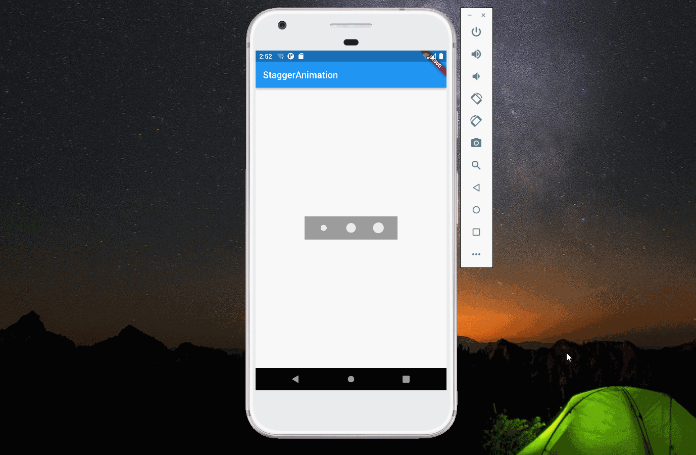

import Image from '@theme/IdealImage';

> 本文是Flutter动画系列的第十五篇，建议读者阅读前面的教程，做到无缝衔接。

  _Tween_ 是 _flutter_ 动画里非常重要的组件，它被用来修改 _AnimationController_，常见的有`Animation<double>`、`ColorTween`、`CurveTween`等。本文将介绍如何使用自定义 _Tween_ 实现下面动画。

### 1. Tween原理

 在介绍自定义 _Tween_ 前，先介绍 _AnimationController_ 和 _Tween_ 是如何工作的。_AnimationController_ 继承了 _Animation&lt;double>_ ，同时它有很多控制动画执行的方法。它能在用户指定的时间( _duration_ )，每隔固定的间隔（硬件的刷新频率）线性的产生[0,1]之间的数。

 _Tween_ 一般通过调用 _animate_ 方法来修改 _AnimationController_。_animate_ 方法返回一个 \__AnimatedEvaluation_ 对象，这个对象的 _value_ 属性最终会调用 _Tween_ 的 _transform_ 方法，参数为 _AnimationController_ 的 _value_ 值。 _transform_ 经过简单处理后，会调用 _lerp_ 方法，_lerp_ 方法里，核心的计算逻辑如下，当 _t_ 为0时，结果为 _begin_ ；当 _t_ 为1时，结果为 _end_ 。

    result = (begin as dynamic) + ((end as dynamic) - (begin as dynamic)) * t;

  _Tween_ 支持链式操作，通过 _chain_ 方法实现多个 _Tween_ 连接，最终作用于 _AnimationController_ (实际上只要是 _Animation_ 就可以)。

 自定义 _Tween_ 可以通过覆盖 _transform_ 或者 _lerp_ 方法来实现我们想要的动画效果。

### 2. 动画分析

 本文动画的几个特点：

1.  动画在不停重复，从效果看，动画结束后重新开始过渡自然，所以需要将0和1映射成相同值。
2.  后面一个圆圈和前面一个圆圈变化趋势一样，只是慢了半拍。
3.  综合以上，使用周期为1（这样0和1值相同）的三角函数 _sinx_ 即可满足需求。

### 3. 完整代码

 从代码可以看到，`TestTween`定义了延迟参数（相当于将 _sinx_ 像左进行平移），这样就能实现后面圆慢半拍的效果。

    import 'dart:math';

    import 'package:flutter/material.dart';

    void main(List<String> args) {
      runApp(const MyApp());
    }

    class MyApp extends StatelessWidget {
      const MyApp({Key? key}) : super(key: key);

      @override
      Widget build(BuildContext context) {
        return const MaterialApp(
          title: "my-app",
          home: HomePage(),
        );
      }
    }

    class HomePage extends StatelessWidget {
      const HomePage({Key? key}) : super(key: key);

      @override
      Widget build(BuildContext context) {
        return Scaffold(
          appBar: AppBar(title: const Text("StaggerAnimation")),
          body: const Center(child: CircleLoader()),
        );
      }
    }

    class CircleLoader extends StatefulWidget {
      const CircleLoader({Key? key}) : super(key: key);

      @override
      _CircleLoaderState createState() => _CircleLoaderState();
    }

    class _CircleLoaderState extends State<CircleLoader>
        with SingleTickerProviderStateMixin {
      late AnimationController _controller;

      @override
      initState() {
        super.initState();
        _controller = AnimationController(
          vsync: this,
          duration: const Duration(seconds: 2),
        )..repeat();
      }

      @override
      dispose() {
        _controller.dispose();
        super.dispose();
      }

      buildCircle(double delay) {
        return ScaleTransition(
          scale: TestTween(begin: .85, end: 1.5, delay: delay).animate(_controller),
          child: Padding(
            padding: const EdgeInsets.all(8.0),
            child: Container(
              height: 20.0,
              width: 20.0,
              decoration: BoxDecoration(
                shape: BoxShape.circle,
                color: Colors.grey[300],
              ),
            ),
          ),
        );
      }

      @override
      Widget build(BuildContext context) {
        return Center(
          child: Container(
            width: 200.0,
            height: 50.0,
            color: Colors.grey,
            child: Row(
              mainAxisAlignment: MainAxisAlignment.spaceEvenly,
              children: <Widget>[
                buildCircle(.0),
                buildCircle(.2),
                buildCircle(.4),
              ],
            ),
          ),
        );
      }
    }

    class TestTween extends Tween<double> {
      final double delay;

      TestTween({required double begin, required double end, required this.delay})
          : super(begin: begin, end: end);

      @override
      double lerp(double t) {
        return super.lerp((sin((t - delay) * 2 * pi) + 1) / 2);
      }
    }

### 4. 总结

 除了自定义 _Tween_，还可以通过自定义 _curve_ 来实现上述动画，感兴趣的读者可以进行尝试。

* * *

1.  [How to chain multiple controller/animation](https://stackoverflow.com/questions/46720549/how-to-chain-multiple-controller-animation)

[署名-非商业性使用-禁止演绎 4.0 国际](https://creativecommons.org/licenses/by-nc-nd/4.0/deed.zh)
