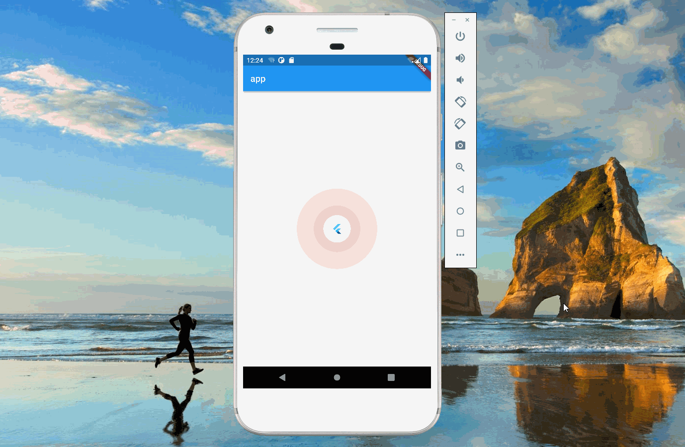

import Image from '@theme/IdealImage';

> 本文是Flutter动画系列的第十三篇，建议读者阅读前面的教程，做到无缝衔接。

 本文介绍 _flutter_ 中如何实现发光动画（也被称为脉冲动画、波纹动画等）。

#### 1. 思路

 该动画由3个组件构成：中间的 _Icon_ 、里层的光环和外层的光环。这三个组件其实叠加在一起，只是尺寸不一样，即它们在一个 _Stack_ 里。

    return Stack(
          alignment: Alignment.center,
          children: [
            Container(
              width: innerWidthAnimation.value,
              height: innerWidthAnimation.value,
              decoration: BoxDecoration(
                  shape: BoxShape.circle,
                  color: Colors.red.withOpacity(backGrounOpacity.value)),
            ),
            Container(
              width: outerWidthAnimation.value,
              height: outerWidthAnimation.value,
              decoration: BoxDecoration(
                  shape: BoxShape.circle,
                  color: Colors.red.withOpacity(backGrounOpacity.value)),
            ),
            const CircleAvatar(
              backgroundColor: Colors.white,
              radius: 30,
              child: FlutterLogo(),
            )
          ],
        );

#### 2. 光环

 光环通过 _BoxDecoration_ 实现，设置盒子的形状为圆形即可。盒子的两个属性会发生变化：颜色的透明度和尺寸，这两个元素由 _AnimationController_ 控制。动画在执行过程中，就能看到光环效果了。

#### 3. 完整代码

    import 'package:flutter/material.dart';

    void main() {
      runApp(const Main());
    }

    class Main extends StatelessWidget {
      const Main({Key? key}) : super(key: key);

      @override
      Widget build(BuildContext context) {
        return MaterialApp(
            title: "app",
            home: Scaffold(
              appBar: AppBar(
                title: const Text("app"),
              ),
              body: const Center(child: Glow()),
            ));
      }
    }

    class Glow extends StatefulWidget {
      const Glow({Key? key}) : super(key: key);

      @override
      State<Glow> createState() => _GlowState();
    }

    class _GlowState extends State<Glow> with SingleTickerProviderStateMixin {
      late AnimationController controller;
      late Animation<double> innerWidthAnimation;
      late Animation<double> outerWidthAnimation;
      late Animation<double> backGrounOpacity;
      @override
      void initState() {
        controller =
            AnimationController(vsync: this, duration: const Duration(seconds: 2))
              ..addListener(() {
                setState(() {});
              });

        innerWidthAnimation =
            Tween<double>(begin: 80.0, end: 120.0).animate(controller);

        outerWidthAnimation =
            Tween<double>(begin: 150, end: 200.0).animate(controller);
        backGrounOpacity = Tween<double>(begin: 0.3, end: 0.0).animate(controller);
        super.initState();
        controller.repeat();
      }

      @override
      Widget build(BuildContext context) {
        return Stack(
          alignment: Alignment.center,
          children: [
            Container(
              width: innerWidthAnimation.value,
              height: innerWidthAnimation.value,
              decoration: BoxDecoration(
                  shape: BoxShape.circle,
                  color: Colors.red.withOpacity(backGrounOpacity.value)),
            ),
            Container(
              width: outerWidthAnimation.value,
              height: outerWidthAnimation.value,
              decoration: BoxDecoration(
                  shape: BoxShape.circle,
                  color: Colors.red.withOpacity(backGrounOpacity.value)),
            ),
            const CircleAvatar(
              backgroundColor: Colors.white,
              radius: 30,
              child: FlutterLogo(),
            )
          ],
        );
      }
    }

* * *

1.  [avatar_glow](https://github.com/apgapg/avatar_glow)

[署名-非商业性使用-禁止演绎 4.0 国际](https://creativecommons.org/licenses/by-nc-nd/4.0/deed.zh)
