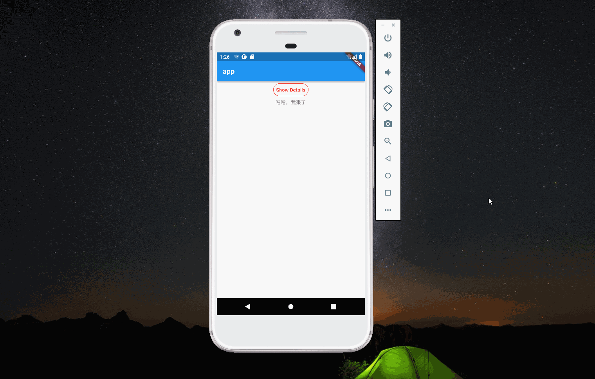

<head>
  <link rel="stylesheet" href="https://cdn.jsdelivr.net/npm/katex@0.13.24/dist/katex.min.css" integrity="sha384-odtC+0UGzzFL/6PNoE8rX/SPcQDXBJ+uRepguP4QkPCm2LBxH3FA3y+fKSiJ+AmM" crossorigin="anonymous" />
</head>

import Image from '@theme/IdealImage';

 应用里的 _ui_ 不可避免的会发生变化，如果 _ui_ 的变化没有衔接，就会显得不自然。动画能够很好的帮助 _ui_ 进行过渡，让我们的应用显得自然又炫酷。

 _flutter_ 提供了一套完整的工具，来满足不同的动画需求，本文介绍最基础的，即组件属性变化的动画，例如透明度从1变成0，背景颜色从红色变成蓝色等。

#### 透明度变化动画

 _flutter_ 提供了`AnimatedOpacity`来处理透明度变化的动画，它是一个特殊的 _Widget_。下面例子里，点击按钮，会慢慢的显示一行文字，再次点击按钮文字会慢慢消失。

 动画可以理解为：在指定的时间(_Duration_)，_ui_ 从状态 _A_ 过渡到状态 _B_（本文的例子里指透明度从0变成1，或者从1变成0）。_flutter_ 在处理动画时，每隔一个时间间隔，就会重新渲染一次 _ui_，_ui_ 状态是 _A_ 到 _B_ 的某个中间态（本文的例子里透明度0.3即为一个中间态）。

    import 'package:flutter/material.dart';

    void main() {
      runApp(const Main());
    }

    class Main extends StatelessWidget {
      const Main({Key? key}) : super(key: key);

      @override
      Widget build(BuildContext context) {
        return MaterialApp(
          title: "app",
          home: Scaffold(
            appBar: AppBar(
              title: const Text("app"),
            ),
            body: const Center(child: Fade()),
          ),
        );
      }
    }

    class Fade extends StatefulWidget {
      const Fade({Key? key}) : super(key: key);

      @override
      MainState createState() => MainState();
    }

    class MainState extends State<Fade> {
      double opacity = 0;

      @override
      Widget build(BuildContext context) {
        return Column(children: <Widget>[
          TextButton(
            style: ButtonStyle(
                shape: MaterialStateProperty.all<RoundedRectangleBorder>(
                    RoundedRectangleBorder(
                        borderRadius: BorderRadius.circular(18.0),
                        side: const BorderSide(color: Colors.red)))),
            onPressed: () => setState(() {
              opacity = 1 - opacity;
            }),
            child: const Text(
              'Show Details',
              style: TextStyle(color: Colors.red),
            ),
          ),
          AnimatedOpacity(
            duration: const Duration(seconds: 1),
            opacity: opacity,
            child: Column(
              children: const [
                Text('哈哈，我来了'),
              ],
            ),
          )
        ]);
      }
    }

 从代码可以看到，当按钮被点击时，`AnimatedOpacity`的`opacity`属性会被修改，它会做好`opacity`的过渡，让变化看起来自然。

#### 设置动画的curve参数

 动画在执行过程中，每隔固定的时间（例如一秒刷新60次）刷新一次 _ui_。每次刷新时，会计算一次透明度。透明度的值和时间满足某种函数关系，即:

$$
opacity = f(t)
$$

 `AnimatedOpacity` 的构造函数里使用`curve`参数来设置 _f(t)_，最常见的 _curve_ 是 _Curves.linear_，当然也支持用户自定义。自定义 _curve_ 函数将在后面文章里介绍。

#### 动画结束回调

 `AnimatedOpacity`的构造函数中，通过`onEnd`指定动画结束时的回调。还是上面的例子，当点击按钮时，动画开始执行，这时希望不再响应用户的点击事件。当动画完成时，再响应用户的点击事件。代码如下：

    import 'package:flutter/material.dart';

    void main() {
      runApp(const Main());
    }

    class Main extends StatelessWidget {
      const Main({Key? key}) : super(key: key);

      @override
      Widget build(BuildContext context) {
        return MaterialApp(
          title: "app",
          home: Scaffold(
            appBar: AppBar(
              title: const Text("app"),
            ),
            body: const Center(child: Fade()),
          ),
        );
      }
    }

    class Fade extends StatefulWidget {
      const Fade({Key? key}) : super(key: key);

      @override
      MainState createState() => MainState();
    }

    class MainState extends State<Fade> {
      double opacity = 0;
      bool running = false;

      @override
      Widget build(BuildContext context) {
        return Column(children: <Widget>[
          TextButton(
            style: ButtonStyle(
                shape: MaterialStateProperty.all<RoundedRectangleBorder>(
                    RoundedRectangleBorder(
                        borderRadius: BorderRadius.circular(18.0),
                        side: BorderSide(
                            color: running ? Colors.grey : Colors.red)))),
            onPressed: () {
              if (!running) {
                setState(() {
                  running = true;
                  opacity = 1 - opacity;
                });
              }
            },
            child: Text(
              'Show Details',
              style: TextStyle(color: running ? Colors.grey : Colors.red),
            ),
          ),
          AnimatedOpacity(
            duration: const Duration(seconds: 2),
            opacity: opacity,
            onEnd: () => setState(() {
              running = false;
            }),
            child: Column(
              children: const [
                Text('哈哈，我来了'),
              ],
            ),
          )
        ]);
      }
    }

[署名-非商业性使用-禁止演绎 4.0 国际](https://creativecommons.org/licenses/by-nc-nd/4.0/deed.zh)
