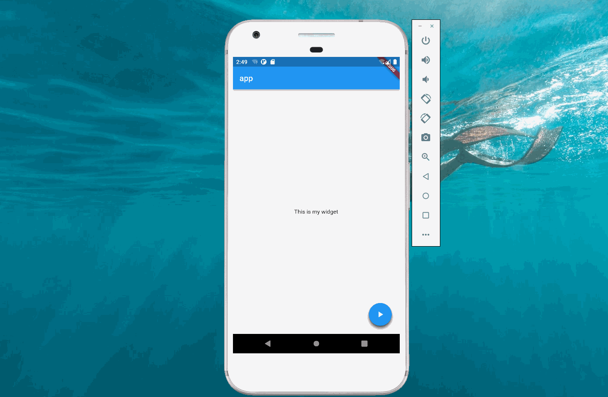

import Image from '@theme/IdealImage';

> 本文是Flutter动画系列的第十篇，建议读者阅读前面的教程，做到无缝衔接。

 [FloatingActionButton](https://api.flutter.dev/flutter/material/FloatingActionButton-class.html)是 _flutter_ 提供的一种非常常用的按钮组件，本文介绍如何实现点击 _FloatingActionButton_ 后菜单弹出的动画。

#### 1. 按钮列表

 对于菜单弹出动画，可以先展示按钮列表，然后再考虑实现动画。按钮列表的代码非常的简单，只需向一个 _Column_ 里添加4个 _FloatingActionButton_ 即可，代码如下。

    import 'package:flutter/material.dart';

    void main() {
      runApp(const Main());
    }

    class Main extends StatelessWidget {
      const Main({Key? key}) : super(key: key);

      @override
      Widget build(BuildContext context) {
        return MaterialApp(
          title: "app",
          home: Scaffold(
              appBar: AppBar(
                title: const Text("app"),
              ),
              body: const Center(child: Text("This is my widget")),
              floatingActionButton: const MyFloatingButton()),
        );
      }
    }

    class MyFloatingButton extends StatefulWidget {
      const MyFloatingButton({Key? key}) : super(key: key);

      @override
      MainState createState() => MainState();
    }

    class MainState extends State<MyFloatingButton>
        with SingleTickerProviderStateMixin {
      @override
      Widget build(BuildContext context) {
        return Column(
          mainAxisAlignment: MainAxisAlignment.end,
          children: [
            Padding(
              padding: const EdgeInsets.all(4.0),
              child: FloatingActionButton(
                onPressed: () {},
                child: const Icon(Icons.access_alarms),
              ),
            ),
            Padding(
              padding: const EdgeInsets.all(4.0),
              child: FloatingActionButton(
                onPressed: () {},
                child: const Icon(Icons.expand_more),
              ),
            ),
            Padding(
              padding: const EdgeInsets.all(4.0),
              child: FloatingActionButton(
                onPressed: () {},
                child: const Icon(Icons.clear_all),
              ),
            ),
            Padding(
              padding: const EdgeInsets.all(4.0),
              child: FloatingActionButton(
                onPressed: () {},
                child: const Icon(Icons.play_arrow),
              ),
            )
          ],
        );
      }
    }

#### 2. SlideTransition

 在[如何实现手持弹幕](./scroll-text.md)中介绍了 _SlideTransition_ 的使用，菜单弹出的的动画也可以使用 _SlideTransition_ 实现。当最后一个按钮被点击时，第一、二、三个按钮滑动到指定位置即可。

 动画未开始时，前三个按钮和最后一个按钮重叠在一起。考虑到这四个按钮的高度是一样的。相当于起始的 _Offset_ 为(0,3),(0,2),(0,1)，最后都回到(0,0)（即各自原本的位置）。

#### 3. 完整代码

    import 'package:flutter/material.dart';

    void main() {
      runApp(const Main());
    }

    class Main extends StatelessWidget {
      const Main({Key? key}) : super(key: key);

      @override
      Widget build(BuildContext context) {
        return MaterialApp(
          title: "app",
          home: Scaffold(
              appBar: AppBar(
                title: const Text("app"),
              ),
              body: const Center(child: Text("This is my widget")),
              floatingActionButton: const MyFloatingButton()),
        );
      }
    }

    class MyFloatingButton extends StatefulWidget {
      const MyFloatingButton({Key? key}) : super(key: key);

      @override
      MainState createState() => MainState();
    }

    class MainState extends State<MyFloatingButton>
        with SingleTickerProviderStateMixin {
      late AnimationController controller;
      late Animation<Offset> firstIcon;
      late Animation<Offset> secondIcon;
      late Animation<Offset> thirdIcon;

      @override
      void initState() {
        super.initState();
        controller = AnimationController(
            vsync: this, duration: const Duration(milliseconds: 500));
        firstIcon = Tween<Offset>(
                begin: const Offset(0.0, 1.0), end: const Offset(0.0, 0.0))
            .animate(controller);
        secondIcon = Tween<Offset>(
                begin: const Offset(0.0, 2.0), end: const Offset(0.0, 0.0))
            .animate(controller);

        thirdIcon = Tween<Offset>(
                begin: const Offset(0.0, 3.0), end: const Offset(0.0, 0.0))
            .animate(controller);
      }

      @override
      void dispose() {
        controller.dispose();
        super.dispose();
      }

      @override
      Widget build(BuildContext context) {
        return Column(
          mainAxisAlignment: MainAxisAlignment.end,
          children: [
            SlideTransition(
              position: thirdIcon,
              child: Padding(
                padding: const EdgeInsets.all(4.0),
                child: FloatingActionButton(
                  onPressed: () {},
                  child: const Icon(Icons.access_alarms),
                ),
              ),
            ),
            SlideTransition(
              position: secondIcon,
              child: Padding(
                padding: const EdgeInsets.all(4.0),
                child: FloatingActionButton(
                  onPressed: () {},
                  child: const Icon(Icons.expand_more),
                ),
              ),
            ),
            SlideTransition(
              position: firstIcon,
              child: Padding(
                padding: const EdgeInsets.all(4.0),
                child: FloatingActionButton(
                  onPressed: () {},
                  child: const Icon(Icons.clear_all),
                ),
              ),
            ),
            Padding(
              padding: const EdgeInsets.all(4.0),
              child: FloatingActionButton(
                onPressed: () {
                  if (controller.isDismissed) {
                    controller.forward();
                  } else {
                    controller.reverse();
                  }
                },
                child: const Icon(Icons.play_arrow),
              ),
            )
          ],
        );
      }
    }

#### 4. 总结

 本文介绍了最简单的菜单弹出动画，其实在弹出的过程中还可以伴随旋转等，这些内容将在后面的文章中介绍。

[署名-非商业性使用-禁止演绎 4.0 国际](https://creativecommons.org/licenses/by-nc-nd/4.0/deed.zh)
