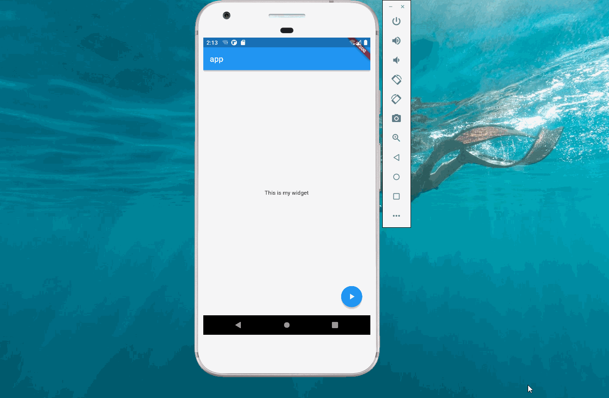

import Image from '@theme/IdealImage';

> 本文是Flutter动画系列的第十一篇，建议读者阅读前面的教程，做到无缝衔接。

 [上篇文章](./menu-expand.md)使用 _SlideTransition_ 实现了菜单弹出的动画，本文将添加更多的动画元素。

 从图中可以看到，按钮被点击后，它图标从⏩变为⏸，同时背景颜色从蓝色变为红色；弹出菜单加上了旋转和透明度变化等。

### 1. AnimationController

 前面文章介绍过[AnimationController](./animation-controller.md)，它是动画控制器，本文声明了一个500毫秒的`AnimationController`，通过`addListener`重新渲染组件。

    controller = AnimationController(
            vsync: this, duration: const Duration(milliseconds: 500))
          ..addListener(() {
            setState(() {});
          });

### 2. 播放按钮

 播放按钮涉及两个动画，图标和背景颜色。图标变化通过`AnimatedIcon`实现，颜色变化通过 _ColorTween_ 实现。

#### 2.1 ColorTween

 为了让播放按钮的背景颜色从蓝色变成红色，本文声明了一个`ColorTween`，它并没有像前面例子那样调用`animation`方法，而是使用`evaluate`计算对应的颜色值。

    iconBackColor = ColorTween(begin: Colors.blue, end: Colors.red);

#### 2.2 AnimatedIcon

 按钮变化的代码非常简单，和之前例子一样，点击时会根据动画的状态来决定正向还是反向播放动画。

    child: FloatingActionButton(
                    backgroundColor: iconBackColor.evaluate(controller),
                    onPressed: () {
                      if (controller.isDismissed) {
                        controller.forward();
                      } else if (controller.isCompleted) {
                        controller.reverse();
                      }
                    },
                    child: AnimatedIcon(
                        icon: AnimatedIcons.play_pause, progress: controller))

### 3. 菜单弹出

 菜单弹出包含三个动画：按钮平移、按钮旋转、按钮透明度变化。

    Opacity(
              opacity: controller.value,
              child: Transform(
                transform:
                    Matrix4.translationValues(0, -controller.value * 60 * 3, 0),
                child: SizedBox(
                  width: 60,
                  height: 60,
                  child: Padding(
                    padding: const EdgeInsets.all(4.0),
                    child: FloatingActionButton(
                      onPressed: () {},
                      child: Transform.rotate(
                          angle: (1 - controller.value) * pi,
                          child: const Icon(Icons.access_alarms)),
                    ),
                  ),
                ),
              ),

 最外层的`Opacity`用来控制透明度变化，它的值为`AnimationController`的值，即[0,1]。当点击弹出菜单时，透明度从0变到1，当收起菜单时，透明度从1变成0.

 第二层是`Transform`，它用来实现平移。需要说明的是`transform`的值不同于`SlideTransition`里的`Offset`。为此使用`SizedBox`将每一个 _Icon_ 的大小设置为60，按照60的倍数进行平移。

 最里层的`Transform`用来实现 _Icon_ 的旋转，当动画开始时,`angle`为-Π；动画结束时`angel`为0，即不旋转。

### 4. 完整代码

    import 'dart:math';

    import 'package:flutter/material.dart';

    void main() {
      runApp(const Main());
    }

    class Main extends StatelessWidget {
      const Main({Key? key}) : super(key: key);

      @override
      Widget build(BuildContext context) {
        return MaterialApp(
          title: "app",
          home: Scaffold(
              appBar: AppBar(
                title: const Text("app"),
              ),
              body: const Center(child: Text("This is my widget")),
              floatingActionButton: const MyFloatingButton()),
        );
      }
    }

    class MyFloatingButton extends StatefulWidget {
      const MyFloatingButton({Key? key}) : super(key: key);

      @override
      MainState createState() => MainState();
    }

    class MainState extends State<MyFloatingButton>
        with SingleTickerProviderStateMixin {
      late AnimationController controller;
      late ColorTween iconBackColor;
      @override
      void initState() {
        super.initState();
        controller = AnimationController(
            vsync: this, duration: const Duration(milliseconds: 500))
          ..addListener(() {
            setState(() {});
          });
        iconBackColor = ColorTween(begin: Colors.blue, end: Colors.red);
      }

      @override
      Widget build(BuildContext context) {
        return Stack(
          children: [
            Opacity(
              opacity: controller.value,
              child: Transform(
                transform:
                    Matrix4.translationValues(0, -controller.value * 60 * 3, 0),
                child: SizedBox(
                  width: 60,
                  height: 60,
                  child: Padding(
                    padding: const EdgeInsets.all(4.0),
                    child: FloatingActionButton(
                      onPressed: () {},
                      child: Transform.rotate(
                          angle: (1 - controller.value) * pi,
                          child: const Icon(Icons.access_alarms)),
                    ),
                  ),
                ),
              ),
            ),
            Opacity(
              opacity: controller.value,
              child: Transform(
                transform:
                    Matrix4.translationValues(0, -controller.value * 60 * 2, 0),
                child: SizedBox(
                  width: 60,
                  height: 60,
                  child: Padding(
                    padding: const EdgeInsets.all(4.0),
                    child: FloatingActionButton(
                      onPressed: () {},
                      child: Transform.rotate(
                          angle: (1 - controller.value) * pi,
                          child: const Icon(Icons.expand_more)),
                    ),
                  ),
                ),
              ),
            ),
            Opacity(
              opacity: controller.value,
              child: Transform(
                transform: Matrix4.translationValues(0, -controller.value * 60, 0),
                child: SizedBox(
                  width: 60,
                  height: 60,
                  child: Padding(
                    padding: const EdgeInsets.all(4.0),
                    child: FloatingActionButton(
                      onPressed: () {},
                      child: Transform.rotate(
                          angle: (1 - controller.value) * pi,
                          child: const Icon(Icons.clear_all)),
                    ),
                  ),
                ),
              ),
            ),
            SizedBox(
              width: 60,
              height: 60,
              child: Padding(
                padding: const EdgeInsets.all(4.0),
                child: FloatingActionButton(
                    backgroundColor: iconBackColor.evaluate(controller),
                    onPressed: () {
                      if (controller.isDismissed) {
                        controller.forward();
                      } else if (controller.isCompleted) {
                        controller.reverse();
                      }
                    },
                    child: AnimatedIcon(
                        icon: AnimatedIcons.play_pause, progress: controller)),
              ),
            ),
          ],
        );
      }
    }

[署名-非商业性使用-禁止演绎 4.0 国际](https://creativecommons.org/licenses/by-nc-nd/4.0/deed.zh)
