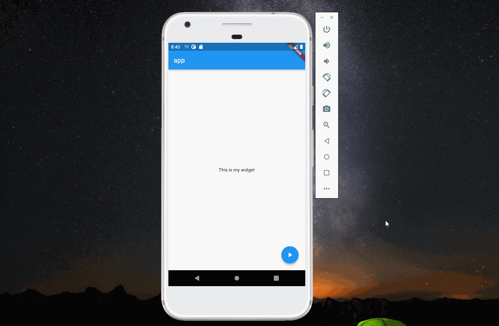

<head>
  <link rel="stylesheet" href="https://cdn.jsdelivr.net/npm/katex@0.13.24/dist/katex.min.css" integrity="sha384-odtC+0UGzzFL/6PNoE8rX/SPcQDXBJ+uRepguP4QkPCm2LBxH3FA3y+fKSiJ+AmM" crossorigin="anonymous" />
</head>

import Image from '@theme/IdealImage';

> 本文是Flutter动画系列的第十二篇，建议读者阅读前面的教程，做到无缝衔接。

 [上篇文章](./menu-expand2)介绍了竖直方向菜单弹出动画，本文介绍扇形菜单弹出动画。

:::tip

 本文实现和上篇文章重合度非常高，建议先看完上篇文章。

:::

#### 1. 水平按钮

 水平方向按钮的改动非常小，只需要将平移从 _y_ 轴改为 _x_ 轴。

    transform: Matrix4.translationValues(-controller.value * 100, 0, 0)

:::caution

 扇形动画平移的距离改为100。

:::

#### 2. 45°角按钮

 45°角按钮的平移需要修改 _x_ 和 _y_ ，根据勾股定理有下面公式：

$$

x^2 + y ^2 = (controller.value * 100) ^ 2

$$

 _flutter_ 提供`Offset.fromDirection`计算 _x_ 和 _y_ ，第一个参数为角度，即45°，第二个参数为距离。使用时需注意坐标为 _-x_ 和 _-y_ 。

    offset = Offset.fromDirection(pi / 4, 100 * controller.value);

#### 3. TweenSequence

 从动画效果看，按钮并不是直接平移到终点，而是有一个回缩的动作，这通过`TweenSequence`实现。`TweenSequence`定义了两个`TweenSequenceItem`，一个从[0.0,1.2]，一个从[1.2,1.0]，后面参数为两个 _item_ 的权重。第一个占整个动画的75%，第二个占整个动画的25%。

    tweenSequence = TweenSequence<double>([
          TweenSequenceItem(tween: Tween<double>(begin: 0.0, end: 1.2), weight: 75),
          TweenSequenceItem(tween: Tween<double>(begin: 1.2, end: 1.0), weight: 25)
        ]).animate(controller);

#### 4. 完整代码

    import 'dart:math';

    import 'package:flutter/material.dart';

    void main() {
      runApp(const Main());
    }

    class Main extends StatelessWidget {
      const Main({Key? key}) : super(key: key);

      @override
      Widget build(BuildContext context) {
        return MaterialApp(
          title: "app",
          home: Scaffold(
              appBar: AppBar(
                title: const Text("app"),
              ),
              body: const Center(child: Text("This is my widget")),
              floatingActionButton: const MyFloatingButton()),
        );
      }
    }

    class MyFloatingButton extends StatefulWidget {
      const MyFloatingButton({Key? key}) : super(key: key);

      @override
      MainState createState() => MainState();
    }

    class MainState extends State<MyFloatingButton>
        with SingleTickerProviderStateMixin {
      late AnimationController controller;
      late ColorTween iconBackColor;
      late Offset offset = const Offset(0, 0);
      late Animation<double> tweenSequence;
      @override
      void initState() {
        super.initState();
        controller = AnimationController(
            vsync: this, duration: const Duration(milliseconds: 500))
          ..addListener(() {
            setState(() {
              offset = Offset.fromDirection(pi / 4, 100 * tweenSequence.value);
            });
          });

        tweenSequence = TweenSequence<double>([
          TweenSequenceItem(tween: Tween<double>(begin: 0.0, end: 1.2), weight: 75),
          TweenSequenceItem(tween: Tween<double>(begin: 1.2, end: 1.0), weight: 25)
        ]).animate(controller);
        iconBackColor = ColorTween(begin: Colors.blue, end: Colors.red);
      }

      @override
      Widget build(BuildContext context) {
        return Stack(
          children: [
            Opacity(
              opacity: controller.value,
              child: Transform(
                transform:
                    Matrix4.translationValues(0, -tweenSequence.value * 100, 0),
                child: SizedBox(
                  width: 60,
                  height: 60,
                  child: Padding(
                    padding: const EdgeInsets.all(4.0),
                    child: FloatingActionButton(
                      onPressed: () {},
                      child: Transform.rotate(
                          angle: (1 - controller.value) * pi,
                          child: const Icon(Icons.access_alarms)),
                    ),
                  ),
                ),
              ),
            ),
            Opacity(
              opacity: controller.value,
              child: Transform(
                transform: Matrix4.translationValues(-offset.dx, -offset.dy, 0),
                child: SizedBox(
                  width: 60,
                  height: 60,
                  child: Padding(
                    padding: const EdgeInsets.all(4.0),
                    child: FloatingActionButton(
                      onPressed: () {},
                      child: Transform.rotate(
                          angle: (1 - controller.value) * pi,
                          child: const Icon(Icons.expand_more)),
                    ),
                  ),
                ),
              ),
            ),
            Opacity(
              opacity: controller.value,
              child: Transform(
                transform:
                    Matrix4.translationValues(-tweenSequence.value * 100, 0, 0),
                child: SizedBox(
                  width: 60,
                  height: 60,
                  child: Padding(
                    padding: const EdgeInsets.all(4.0),
                    child: FloatingActionButton(
                      onPressed: () {},
                      child: Transform.rotate(
                          angle: (1 - controller.value) * pi,
                          child: const Icon(Icons.clear_all)),
                    ),
                  ),
                ),
              ),
            ),
            SizedBox(
              width: 60,
              height: 60,
              child: Padding(
                padding: const EdgeInsets.all(4.0),
                child: FloatingActionButton(
                    backgroundColor: iconBackColor.evaluate(controller),
                    onPressed: () {
                      if (controller.isDismissed) {
                        controller.forward();
                      } else if (controller.isCompleted) {
                        controller.reverse();
                      }
                    },
                    child: AnimatedIcon(
                        icon: AnimatedIcons.play_pause, progress: controller)),
              ),
            ),
          ],
        );
      }
    }

[署名-非商业性使用-禁止演绎 4.0 国际](https://creativecommons.org/licenses/by-nc-nd/4.0/deed.zh)
