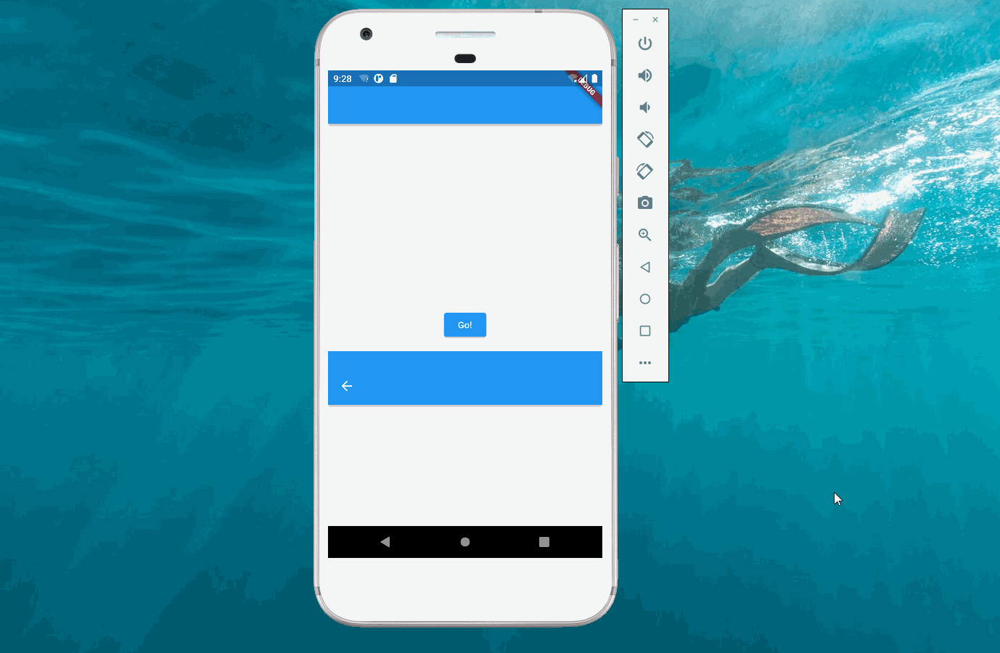

import Image from '@theme/IdealImage';

> 本文是Flutter动画系列的第六篇，建议读者阅读前面的教程，做到无缝衔接。

 应用里难免需要从页面 _A_ 跳转到页面 _B_ ，本文介绍 _flutter_ 如何实现页面切换动画。

### 1. PageRouteBuilder

 _flutter_ 中，从一个页面跳转到另外一个页面一般使用`Navigator.push`和`Navigator.pop`实现。`push`方法接受`Route`类型的参数，为了实现动画需要使用`PageRouteBuilder`。

 `PageRouteBuilder`构造函数的参数比较多，本文用到的有：

1.  pageBuilder：用来构造页面 _B_，它只调用一次。
2.  transitionsBuilder：用来设置动画的属性。
3.  transitionDuration：动画的时长
4.  reverseTransitionDuration：reverse的动画时长（比如点击返回时）。

### 2. SlideTransition

 `SlideTransition`可以实现组件的移动，从下向上实现页面切换实际上是让页面 _B_ 从`Offset(0,1.0)`变化到`Offset(0.0,0.0)`。

:::tip

 [手持弹幕一文](./scroll-text.md)介绍了如何使用`SlideTransition`，读者可以自行前往阅读。

:::

### 3. 完整代码

 通过以上分析，实现从下向上页面切换非常简单，完整代码如下，其中`transitionsBuilder`包含4个参数，`child`为`pageBuilder`的返回值，即`Page2`。

    import 'package:flutter/material.dart';

    void main() {
      runApp(
        const MaterialApp(
          home: Page1(),
        ),
      );
    }

    class Page1 extends StatelessWidget {
      const Page1({super.key});

      @override
      Widget build(BuildContext context) {
        return Scaffold(
          appBar: AppBar(),
          body: Center(
            child: ElevatedButton(
              onPressed: () {
                Navigator.of(context).push(_createRoute());
              },
              child: const Text('Go!'),
            ),
          ),
        );
      }
    }

    Route _createRoute() {
      return PageRouteBuilder(
        pageBuilder: (context, animation, secondaryAnimation) => const Page2(),
        reverseTransitionDuration: const Duration(seconds: 2),
        transitionDuration: const Duration(seconds: 2),
        transitionsBuilder: (context, animation, secondaryAnimation, child) {
          const begin = Offset(0.0, 1);
          const end = Offset.zero;
          const curve = Curves.linear;
          var tween = Tween(begin: begin, end: end).chain(CurveTween(curve: curve));

          return SlideTransition(
            position: tween.animate(animation),
            child: child,
          );
        },
      );
    }

    class Page2 extends StatelessWidget {
      const Page2({super.key});

      @override
      Widget build(BuildContext context) {
        return Scaffold(
          appBar: AppBar(),
          body: const Center(
            child: Text('Page 2'),
          ),
        );
      }
    }

[署名-非商业性使用-禁止演绎 4.0 国际](https://creativecommons.org/licenses/by-nc-nd/4.0/deed.zh)
