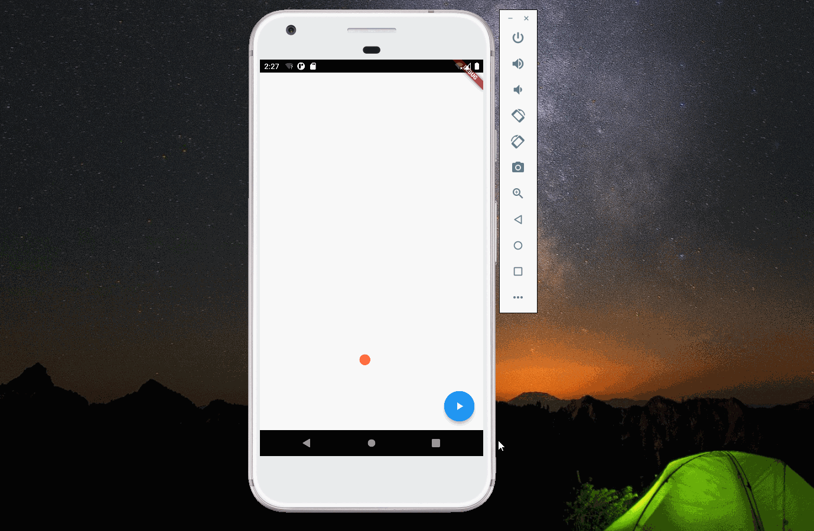

import Image from '@theme/IdealImage';

> 本文是Flutter动画系列的第十六篇，建议读者阅读前面的教程，做到无缝衔接。

 平抛运动是高中物理的一个概念，本文介绍 _flutter_ 如何实现球体平抛动画。

#### 1. 球体如何实现

 看过之前教程的读者不难想到，球体可以使用 _BoxDecoration_ 实现。_Container_ 组件的 _decoration_ 属性可以用来指定修饰子组件的信息。指定 _BoxDecoration_ 的 _shape_ 为圆形，颜色为橙色即可。

    decoration: const BoxDecoration(
                      shape: BoxShape.circle, color: Colors.deepOrangeAccent)

#### 2. 平抛动画

 平抛运动可以拆解为水平方向的匀速直线运动和竖直方向的自由落地运动。为了模拟球撞击地面后反弹的效果，竖直方向使用 _Curves.bounceOut_，而水平方向使用线性即可。

    yAnimation = Tween<double>(begin: 0, end: 200)
           .chain(CurveTween(curve: Curves.bounceOut))
           .animate(controller);
    xAnimation = Tween<double>(begin: 0, end: -200).animate(controller);

#### 3. 完整代码

    import 'package:flutter/material.dart';

    void main(List<String> args) {
      runApp(const MaterialApp(
        title: "Projectile",
        home: HomePage(),
      ));
    }

    class HomePage extends StatelessWidget {
      const HomePage({Key? key}) : super(key: key);

      @override
      Widget build(BuildContext context) {
        return const SafeArea(child: Projectile());
      }
    }

    class Projectile extends StatefulWidget {
      const Projectile({super.key});

      @override
      State<Projectile> createState() => _ProjectileState();
    }

    class _ProjectileState extends State<Projectile>
        with SingleTickerProviderStateMixin {
      late AnimationController controller;
      late Animation<double> yAnimation;
      late Animation<double> xAnimation;
      @override
      void initState() {
        controller =
            AnimationController(vsync: this, duration: const Duration(seconds: 2))
              ..addListener(() {
                setState(() {});
              });
        yAnimation = Tween<double>(begin: 0, end: 200)
            .chain(CurveTween(curve: Curves.bounceOut))
            .animate(controller);
        xAnimation = Tween<double>(begin: 0, end: -200).animate(controller);
        super.initState();
      }

      @override
      Widget build(BuildContext context) {
        return Scaffold(
          body: Align(
            alignment: Alignment.centerRight,
            child: Padding(
              padding: const EdgeInsets.all(8.0),
              child: Transform(
                transform: Matrix4.translationValues(
                    xAnimation.value, yAnimation.value, 0),
                child: Container(
                  width: 20,
                  height: 20,
                  decoration: const BoxDecoration(
                      shape: BoxShape.circle, color: Colors.deepOrangeAccent),
                ),
              ),
            ),
          ),
          floatingActionButton: FloatingActionButton(
            onPressed: () {
              if (!controller.isAnimating) {
                controller.forward(from: 0);
              }
            },
            child: const Icon(Icons.play_arrow),
          ),
        );
      }
    }

[署名-非商业性使用-禁止演绎 4.0 国际](https://creativecommons.org/licenses/by-nc-nd/4.0/deed.zh)
