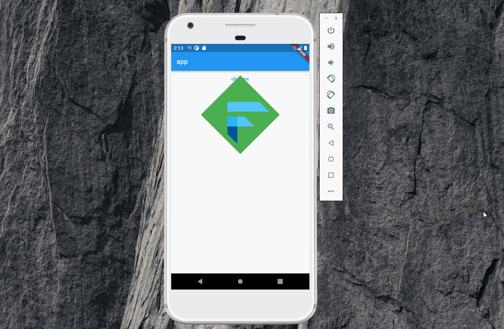

import Image from '@theme/IdealImage';

> 本文是Flutter动画系列的第七篇，建议读者阅读前面的教程，做到无缝衔接。

 本文将介绍 _flutter_ 里如何实现旋转动画，_demo_ 如下。

### 1. RotationTransition

 和[SlideTransition](./scroll-text.md)一样，`RotationTransition`也是`AnimatedWidget`。它的构造函数签名如下，其中`turns`是动画参数，当`turns`的值为 _m_ 时，旋转的角度为 _m \* 2 \* 	Π_，即[0,1]刚好旋转360°。当 _m > 0_ 时，旋转方向为顺时针，当 _m &lt; 0_ 时，旋转方向为逆时针。

    RotationTransition({Key? key, required Animation<double> turns, Alignment alignment = Alignment.center, FilterQuality? filterQuality, Widget? child})

 `alignment`参数用来指定旋转的中心点，默认是正中心，也可以改为左上角，右下角等。_demo_ 完整的代码如下，这里将 _curve_ 设置为 _linear_ ，动画设置为[0,0.5]，即旋转180°，读者可以根据需要自行修改。

    import 'package:flutter/material.dart';

    void main() => runApp(const MyApp());

    class MyApp extends StatelessWidget {
      const MyApp({Key? key}) : super(key: key);

      static const String _title = 'Flutter Code Sample';

      @override
      Widget build(BuildContext context) {
        return const MaterialApp(
          title: _title,
          home: MyStatefulWidget(),
        );
      }
    }

    class MyStatefulWidget extends StatefulWidget {
      const MyStatefulWidget({Key? key}) : super(key: key);

      @override
      State<MyStatefulWidget> createState() => _MyStatefulWidgetState();
    }

    class _MyStatefulWidgetState extends State<MyStatefulWidget>
        with TickerProviderStateMixin {
      late final AnimationController _controller = AnimationController(
        duration: const Duration(seconds: 2),
        vsync: this,
      );
      late final Animation<double> _animation =
          Tween<double>(begin: 0, end: 0.5).animate(CurvedAnimation(
        parent: _controller,
        curve: Curves.linear,
      ));

      @override
      void dispose() {
        _controller.dispose();
        super.dispose();
      }

      @override
      Widget build(BuildContext context) {
        return Scaffold(
          appBar: AppBar(
            title: const Text("app"),
          ),
          body: Center(
            child: Column(
              children: <Widget>[
                TextButton(
                    onPressed: () {
                      if (_controller.isDismissed) {
                        _controller.forward();
                      } else {
                        _controller.reverse();
                      }
                    },
                    child: const Text("click me")),
                RotationTransition(
                  turns: _animation,
                  alignment: Alignment.center,
                  child: Container(
                    color: Colors.green,
                    child: const Padding(
                      padding: EdgeInsets.all(8.0),
                      child: FlutterLogo(size: 150.0),
                    ),
                  ),
                ),
              ],
            ),
          ),
        );
      }
    }

### 2. AnimatedRotation

 和[透明度动画](./implicity-animation.md)类似，旋转动画也有对应的隐式 _Widget_。`AnimatedRotation`的构造函数如下,其中`turns`表示旋转的角度，当`turns`发生变化时（例如本文中从0.0变成0.5，或者反过来从0.5变成0.0），`AnimatedRotation`会以动画的形式完成过渡。

    AnimatedRotation({Key? key, Widget? child, required double turns, Alignment alignment = Alignment.center, FilterQuality? filterQuality, Curve curve = Curves.linear, required Duration duration, VoidCallback? onEnd})

 `alignment`、`curve`参数的含义与`RotationTransition`一致，这么就不再赘述。`onEnd`是动画结束时的回调，这点和`AnimatedOpacity`一致。完整的代码如下，当按钮被点击时，通过`setState`方法触发`AnimatedRotation`的渲染，实现动画效果。

    import 'package:flutter/material.dart';

    void main() => runApp(const MyApp());

    class MyApp extends StatelessWidget {
      const MyApp({Key? key}) : super(key: key);

      static const String _title = 'Flutter Code Sample';

      @override
      Widget build(BuildContext context) {
        return const MaterialApp(
          title: _title,
          home: MyStatefulWidget(),
        );
      }
    }

    class MyStatefulWidget extends StatefulWidget {
      const MyStatefulWidget({Key? key}) : super(key: key);

      @override
      State<MyStatefulWidget> createState() => _MyStatefulWidgetState();
    }

    class _MyStatefulWidgetState extends State<MyStatefulWidget>
        with TickerProviderStateMixin {
      double turns = 0.0;

      @override
      void dispose() {
        super.dispose();
      }

      @override
      Widget build(BuildContext context) {
        return Scaffold(
          appBar: AppBar(
            title: const Text("app"),
          ),
          body: Center(
            child: Column(
              children: <Widget>[
                TextButton(
                    onPressed: () {
                      setState(() {
                        turns = 0.5 - turns;
                      });
                    },
                    child: const Text("click me")),
                AnimatedRotation(
                    turns: turns,
                    duration: const Duration(seconds: 2),
                    curve: Curves.linear,
                    child: Container(
                      color: Colors.green,
                      child: const Padding(
                        padding: EdgeInsets.all(8.0),
                        child: FlutterLogo(size: 150.0),
                      ),
                    ))
              ],
            ),
          ),
        );
      }
    }

### 3. Transform

 在[Animation­Controller](./animation-controller.md)一文里，介绍了使用`Animation­Controller`但不使用 _AnimatedWidget_ 的方法。旋转动画同样也可以使用这种方式来实现：通过`addListener`和`setState`，当动画产生新值时，使用`Transform`这种特殊的 _Widget_ 实现旋转。完整代码如下，其中动画的区间为[0,0.5]，`Transform`里`angle`参数为动画值 _m_ 乘以 _2Π_ 。

    import 'package:flutter/material.dart';
    import 'dart:math';

    void main() => runApp(const MyApp());

    class MyApp extends StatelessWidget {
      const MyApp({Key? key}) : super(key: key);

      static const String _title = 'Flutter Code Sample';

      @override
      Widget build(BuildContext context) {
        return const MaterialApp(
          title: _title,
          home: MyStatefulWidget(),
        );
      }
    }

    class MyStatefulWidget extends StatefulWidget {
      const MyStatefulWidget({Key? key}) : super(key: key);

      @override
      State<MyStatefulWidget> createState() => _MyStatefulWidgetState();
    }

    class _MyStatefulWidgetState extends State<MyStatefulWidget>
        with TickerProviderStateMixin {
      late AnimationController controller;
      late Animation<double> turns;

      @override
      void initState() {
        super.initState();
        controller =
            AnimationController(vsync: this, duration: const Duration(seconds: 2));
        turns = Tween<double>(begin: 0.0, end: 0.5)
            .chain(CurveTween(curve: Curves.linear))
            .animate(controller)
          ..addListener(() {
            setState(() {});
          });
      }

      @override
      void dispose() {
        controller.dispose();
        super.dispose();
      }

      @override
      Widget build(BuildContext context) {
        return Scaffold(
          appBar: AppBar(
            title: const Text("app"),
          ),
          body: Center(
            child: Column(
              children: <Widget>[
                TextButton(
                    onPressed: () {
                      setState(() {
                        if (controller.isDismissed) {
                          controller.forward();
                        } else {
                          controller.reverse();
                        }
                      });
                    },
                    child: const Text("click me")),
                Transform.rotate(
                    angle: pi * turns.value,
                    child: Container(
                      color: Colors.green,
                      child: const Padding(
                        padding: EdgeInsets.all(8.0),
                        child: FlutterLogo(size: 150.0),
                      ),
                    )),
              ],
            ),
          ),
        );
      }
    }

### 4. 总结

 以上三种方式都能实现旋转动画，读者需要理解它们之间的差异。

[署名-非商业性使用-禁止演绎 4.0 国际](https://creativecommons.org/licenses/by-nc-nd/4.0/deed.zh)
