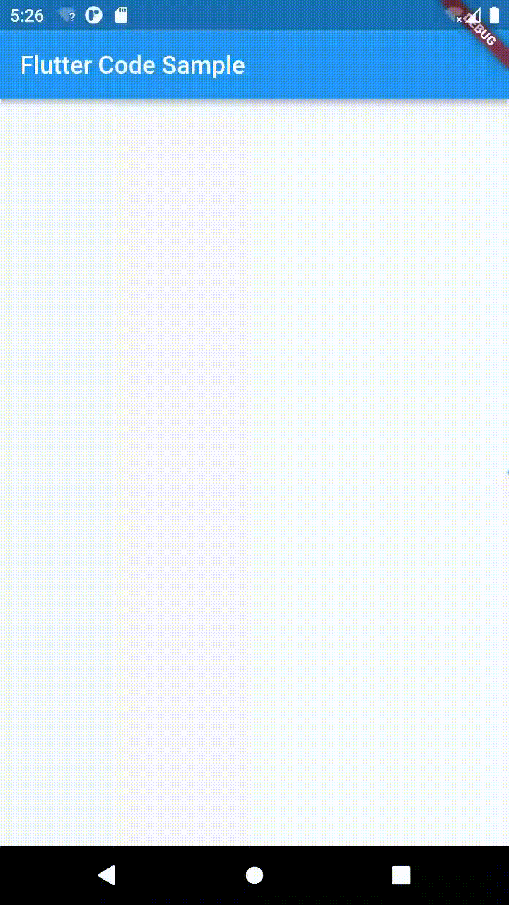

import Image from '@theme/IdealImage';

> 本文是Flutter动画系列的第五篇，建议读者阅读前面的教程，做到无缝衔接。

 在演唱会或者比赛现场，经常看到粉丝举着手机，循环播放文字内容。本文介绍 _flutter_ 如何实现无限滚动效果。

#### 1. SlideTransition

 `SlideTransition`可以用来实现相对于组件原位置的动画，滚动效果实际上是组件的平移，故可以使用`SlideTransition`实现。

 `SlideTransition`实现了`AnimatedWidget`，构造函数里最核心的参数是`position`，它是`Animation<Offset>`类型，其中`Offset`的`x`表示水平方向相对原位置的值，
`y`表示竖直方向相对于原位置的值。`x=0.25`表示组件`1/4`宽度，以此类推。默认情况下，方向和 _canvas_ 的坐标轴一致，即：原点位于左上方，向右是 _x_ 的正方向，向下是 _y_ 的正方向。但可以通过`TextDirection`参数可以改变默认行为。

    SlideTransition({Key? key, required Animation<Offset> position, bool transformHitTests = true, TextDirection? textDirection, Widget? child})

:::tip

 [第三篇教程](./animation-controller)里介绍过`AnimatedWidget`，读者可以自行前往阅读。

:::

#### 2. status监听器

 `AnimationControler`除了可以通过`addListener`监听动画值变化，还可以通过`addStatusListener`监听动画状态变化。在本文的例子里，当动画结束时（即文字移动到屏幕之外时），需要让动画重新开始，达到无限循环的效果。

    late final AnimationController _controller = AnimationController(
        duration: const Duration(seconds: 5),
        vsync: this,
      )
        ..addStatusListener((status) {
          //当动画结束时，从头开始播放动画
          if (status == AnimationStatus.completed) {
            _controller.forward(from: 0.0);
          }
        })

#### 3. 完整代码

 通过上面分析，只需设置好动画的起点和终点，无限滚动的效果并不难实现。下面是完整的代码，其中动画从-0.5开始，即向左1/2组件宽度，此时 _logo_ 不会出现在屏幕中，动画执行过程中 _logo_ 才缓缓出现，直到最后消失。

 实际上，这样计算不是非常严谨。因为 _logo_ 大小为150，且是左对齐，组件的1/2宽可能是小于 _logo_ 的，详细的计算应该要考虑屏幕分辨率。

    import 'package:flutter/material.dart';

    void main() => runApp(const MyApp());

    class MyApp extends StatelessWidget {
      const MyApp({Key? key}) : super(key: key);

      static const String _title = 'Flutter Code Sample';

      @override
      Widget build(BuildContext context) {
        return MaterialApp(
          title: _title,
          home: Scaffold(
            appBar: AppBar(title: const Text(_title)),
            body: const Center(
              child: MyStatefulWidget(),
            ),
          ),
        );
      }
    }

    class MyStatefulWidget extends StatefulWidget {
      const MyStatefulWidget({Key? key}) : super(key: key);

      @override
      State<MyStatefulWidget> createState() => _MyStatefulWidgetState();
    }

    class _MyStatefulWidgetState extends State<MyStatefulWidget>
        with SingleTickerProviderStateMixin {
      late final AnimationController _controller = AnimationController(
        duration: const Duration(seconds: 5),
        vsync: this,
      )
        ..addStatusListener((status) {
          //当动画结束时，从头开始播放动画
          if (status == AnimationStatus.completed) {
            _controller.forward(from: 0.0);
          }
        })
        ..forward();
      late final Animation<Offset> _offsetAnimation = Tween<Offset>(
        //起点设置为负数，这样logo是从左侧边慢慢进入屏幕
        begin: const Offset(-0.5, 0.0),
        end: const Offset(1, 0.0),
      ).animate(CurvedAnimation(
        parent: _controller,
        curve: Curves.linear,
      ));

      @override
      void dispose() {
        _controller.dispose();
        super.dispose();
      }

      @override
      Widget build(BuildContext context) {
        return SizedBox(
          //让
          width: double.infinity,
          child: SlideTransition(
            position: _offsetAnimation,
            child: const Align(
              alignment: Alignment.centerLeft,
              child: FlutterLogo(size: 150.0),
            ),
          ),
        );
      }
    }

[署名-非商业性使用-禁止演绎 4.0 国际](https://creativecommons.org/licenses/by-nc-nd/4.0/deed.zh)
