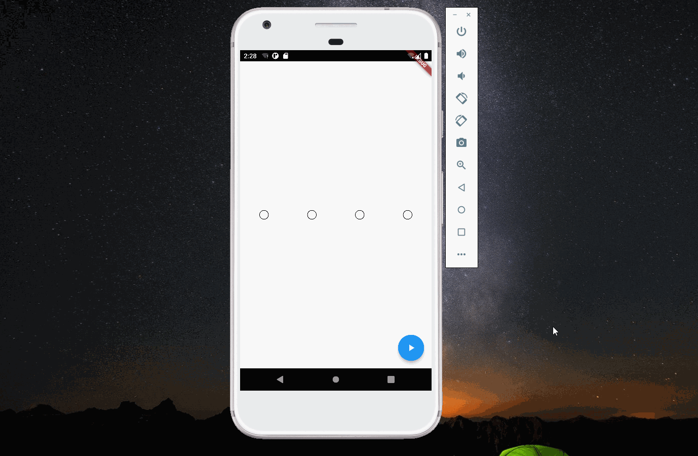

import Image from '@theme/IdealImage';

> 本文是Flutter动画系列的第十七篇，建议读者阅读前面的教程，做到无缝衔接。

 本文介绍在 _flutter_ 中如何实现密码输入错误时的抖动动画。

#### 1. 密码输入框

 密码输入框是一个圆球，看过之前教程的读者应该非常熟悉了，通过 _BoxDecoration_ 就可以实现。多个输入框放在一个 _Row_ 组件里，根据自己的需要，设置 _mainAxisAlignment_ 即可。

    child: Container(
            width: 20,
            height: 20,
            decoration: BoxDecoration(shape: BoxShape.circle, border: Border.all()),
          )

#### 2. 动画函数

 密码输入框会周期性的左右移动，最后回归到起点，这个可以使用三角函数来实现。本文使用的是`sin( x * 4 * pi)`，其中4决定了抖动的频率，在x=0和x=1时，这个函数的值也为0，符合回到起点的设定。

#### 3. 完整代码

    import 'dart:math';

    import 'package:flutter/material.dart';

    void main(List<String> args) {
      runApp(const MaterialApp(
        title: "Projectile",
        home: HomePage(),
      ));
    }

    class HomePage extends StatelessWidget {
      const HomePage({Key? key}) : super(key: key);

      @override
      Widget build(BuildContext context) {
        return const SafeArea(child: Projectile());
      }
    }

    class Projectile extends StatefulWidget {
      const Projectile({super.key});

      @override
      State<Projectile> createState() => _ProjectileState();
    }

    class _ProjectileState extends State<Projectile>
        with SingleTickerProviderStateMixin {
      late AnimationController controller;
      @override
      void initState() {
        controller = AnimationController(
            vsync: this, duration: const Duration(milliseconds: 500));
        super.initState();
      }

      @override
      Widget build(BuildContext context) {
        return Scaffold(
          body: Center(
            child: Row(
              mainAxisAlignment: MainAxisAlignment.spaceAround,
              children: [
                PasswordWidget(offsetAnimation: controller),
                PasswordWidget(
                  offsetAnimation: controller,
                ),
                PasswordWidget(
                  offsetAnimation: controller,
                ),
                PasswordWidget(
                  offsetAnimation: controller,
                ),
              ],
            ),
          ),
          floatingActionButton: FloatingActionButton(
            onPressed: () {
              if (!controller.isAnimating) {
                controller.forward(from: 0);
              }
            },
            child: const Icon(Icons.play_arrow),
          ),
        );
      }
    }

    class PasswordWidget extends StatelessWidget {
      const PasswordWidget({super.key, required this.offsetAnimation});

      final Animation<double> offsetAnimation;

      @override
      Widget build(BuildContext context) {
        return AnimatedBuilder(
          animation: offsetAnimation,
          builder: (context, child) {
            return Padding(
              padding: EdgeInsets.only(
                  left: 24 + 12 * sin(offsetAnimation.value * 4 * pi),
                  right: 24 - 12 * sin(offsetAnimation.value * 4 * pi)),
              child: child,
            );
          },
          child: Container(
            width: 20,
            height: 20,
            decoration: BoxDecoration(shape: BoxShape.circle, border: Border.all()),
          ),
        );
      }
    }

[署名-非商业性使用-禁止演绎 4.0 国际](https://creativecommons.org/licenses/by-nc-nd/4.0/deed.zh)
