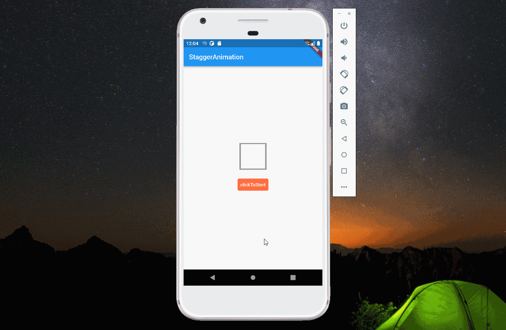

import Image from '@theme/IdealImage';

> 本文是Flutter动画系列的第十四篇，建议读者阅读前面的教程，做到无缝衔接。

 本文介绍 _flutter_ 中如何实现交织动画，下面图中，方框先向上平移，然后开始收缩变成一个球，最后球自由落体。

#### 1. 设计思路

 整个动画分为三段：第一段平移；第二段形状发生了变化，但位置没有变化；第三段平移。这种动画可以使用 _Intervel_ 实现。

#### 2. Interval

 _Interval_ 是 _curve_ 的子类，它的构造函数如下。我们知道 _curve_ 实际是一个函数，那 _Interval_ 也是一个函数：当 _x_ 在[0,begin]之间时，_y_ 为0；当 _x_ 在 [begin,end]之间时，通过`curve`参数进行映射，_x_ 等于 _end_ 时 _y_ 为1；当 _x_ 在[end,1]之间时，_y_ 为1。利用 _Interval_ 的这个特性，能实现本文的动画效果。

    Interval(double begin, double end, {Curve curve = Curves.linear})

 本文定义了三个 _Animation_，它们的 _parent_ 为同一个 _AnimationController_ 。第一个动画是向上平移，它对应的区间是[0.0,0.3]，超过0.3时，它的值不会发生变化；第二个动画是方形变圆形，当[0,0.3]时，它的值为0，所以不会有形状上的变化；第三个动画是平移动画，从最高点落回到起点。这里需要说明的是，第一个和第三个动画都是平移，故需要根据 _controller_ 的值来确定使用哪个动画。

    firstAnimation = Tween(begin: 0.0, end: -160.0).animate(CurvedAnimation(
            parent: controller,
            curve: const Interval(0.0, 0.3, curve: Curves.linear)));

        secondAnimation = Tween(begin: 0.0, end: 40.0).animate(
            CurvedAnimation(parent: controller, curve: const Interval(0.3, 0.6)));

        thirdAnimation = Tween(begin: -160.0, end: 0.0).animate(CurvedAnimation(
            parent: controller,
            curve: const Interval(0.6, 1.0, curve: Curves.bounceOut)));

#### 3. 完整代码

    import 'package:flutter/material.dart';

    void main(List<String> args) {
      runApp(const MyApp());
    }

    class MyApp extends StatelessWidget {
      const MyApp({Key? key}) : super(key: key);

      @override
      Widget build(BuildContext context) {
        return const MaterialApp(
          title: "my-app",
          home: HomePage(),
        );
      }
    }

    class HomePage extends StatelessWidget {
      const HomePage({Key? key}) : super(key: key);

      @override
      Widget build(BuildContext context) {
        return Scaffold(
          appBar: AppBar(title: const Text("StaggerAnimation")),
          body: const Center(child: StaggerAnimation()),
        );
      }
    }

    class StaggerAnimation extends StatefulWidget {
      const StaggerAnimation({Key? key}) : super(key: key);

      @override
      State<StaggerAnimation> createState() => _StaggerAnimationState();
    }

    class _StaggerAnimationState extends State<StaggerAnimation>
        with SingleTickerProviderStateMixin {
      late AnimationController controller;

      late Animation<double> firstAnimation;
      late Animation<double> secondAnimation;
      late Animation<double> thirdAnimation;

      double tran = 0.0;

      @override
      void initState() {
        controller =
            AnimationController(vsync: this, duration: const Duration(seconds: 2))
              ..addListener(() {
                setState(() {
                  if (controller.value > 0.6) {
                    tran = thirdAnimation.value;
                  } else {
                    tran = firstAnimation.value;
                  }
                });
              });
        firstAnimation = Tween(begin: 0.0, end: -160.0).animate(CurvedAnimation(
            parent: controller,
            curve: const Interval(0.0, 0.3, curve: Curves.linear)));

        secondAnimation = Tween(begin: 0.0, end: 40.0).animate(
            CurvedAnimation(parent: controller, curve: const Interval(0.3, 0.6)));

        thirdAnimation = Tween(begin: -160.0, end: 0.0).animate(CurvedAnimation(
            parent: controller,
            curve: const Interval(0.6, 1.0, curve: Curves.bounceOut)));

        super.initState();
      }

      @override
      void dispose() {
        controller.dispose();
        super.dispose();
      }

      @override
      Widget build(BuildContext context) {
        return Column(
          mainAxisAlignment: MainAxisAlignment.center,
          children: [
            Transform(
              transform: Matrix4.translationValues(0.0, tran, 0.0),
              child: Container(
                width: 80,
                height: 80,
                decoration: BoxDecoration(
                    border: Border.all(width: 4, color: Colors.grey),
                    borderRadius: BorderRadius.circular(secondAnimation.value)),
              ),
            ),
            Padding(
              padding: const EdgeInsets.only(top: 20),
              child: TextButton(
                style: ButtonStyle(
                  backgroundColor:
                      MaterialStateProperty.all(Colors.deepOrangeAccent),
                ),
                child: const Text(
                  "clickToStart",
                  style: TextStyle(color: Colors.white),
                ),
                onPressed: () {
                  if (controller.isDismissed) {
                    controller.forward();
                  } else {
                    controller.reverse();
                  }
                },
              ),
            )
          ],
        );
      }
    }

[署名-非商业性使用-禁止演绎 4.0 国际](https://creativecommons.org/licenses/by-nc-nd/4.0/deed.zh)
