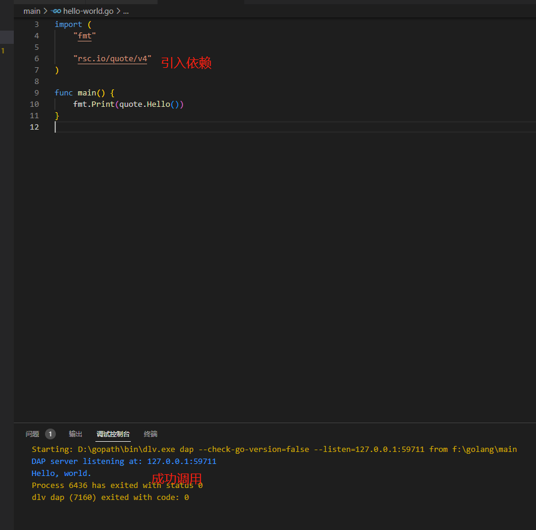
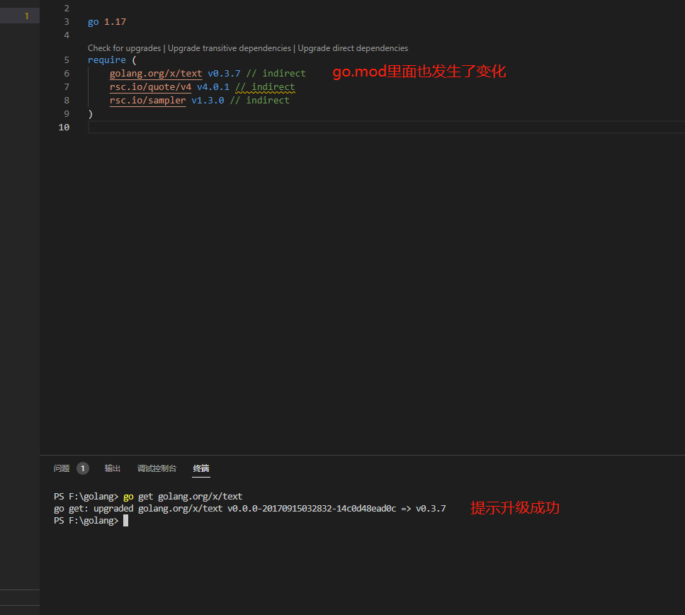
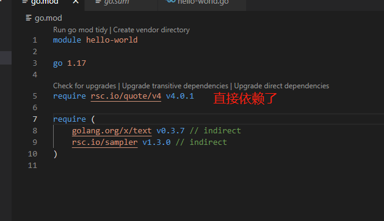

 模块是`golang`代码包的集合，在模块的根目录下有一个`go.mod`文件，这个`go.mod`文件定义了模块的路径、依赖等信息。

    module hello-world

    go 1.17

    require (
    	golang.org/x/text v0.0.0-20170915032832-14c0d48ead0c // indirect
    	rsc.io/quote/v4 v4.0.1 // indirect
    	rsc.io/sampler v1.3.0 // indirect
    )

### 1. 创建新的模块

 在[golang开发环境搭建](/docs/golang/set-up)一文中，介绍了如何创建一个新的模块，这里就不再赘述了。

### 2. 添加依赖

 在`golang`开发过程中，需要用到其他人开发的模块。像`Maven`、`NPM`这些包管理工具，都有一个中心仓库，开发者开发好软件包之后，提交到中心仓库，其他人就可以使用了。`golang`的包管理思路不同于以上，`golang`采用的是一种半中心化的思路。任意的`git`仓库都可以作为`golang`的包仓库，只要仔细观察你就会发现不同的包会来自不同的地址（这点和`Maven`、`NPM`非常不同）。

> By default, the go command may download modules from <https://proxy.golang.org>. It may authenticate modules using the checksum database at <https://sum.golang.org>. Both services are operated by the Go team at Google.The privacy policies for these services are available at <https://proxy.golang.org/privacy> and <https://sum.golang.org/privacy>, respectively.
>
> The go command's download behavior may be configured using GOPROXY, GOSUMDB,GOPRIVATE, and other environment variables

 当执行`go get`命令的时候，`golang`首先检查本地是否有需要安装的包，如果没有找到，它就会去服务器上下载。下载的地址取决于`GOPROXY`这个变量的值，`GOPROXY`的默认值为：`https://proxy.golang.org, direct`。这个默认值的含义是，如果在`https://proxy.golang.org`没有找到需要安装的包，就会去命令提供的`URL`里下载。

 `proxy.golang.org`是由`google`运营的模块镜像仓库，它会从源服务器同步模块到`proxy.golang.org`，当用户安装时，优先从`proxy.golang.org`下载。

:::caution

中国大陆屏蔽了`proxy.golang.org`，只能使用其他的镜像仓库，例如：[goproxy.cn](https://github.com/goproxy/goproxy.cn/blob/master/README.zh-CN.md)。使用的时候，修改`GOPROXY`的值即可。

    $ go env -w GO111MODULE=on
    $ go env -w GOPROXY=https://goproxy.cn,direct

:::

 接下来，看看执行`go get rsc.io/quote/v4`后，发生了什么。

1.  `go.mod`文件里面多了`require`的内容。
2.  多了文件`go.sum`

 `require`比较好理解，在执行`go get`的时候，将包的依赖加到`go.mod`中。`go.sum`文件的每一行数据包括包名、包版本和对应的`hash`值，它用来保证之后下载的包与第一次下载的包一致，防止包被恶意篡改。

 在代码里面引入`quote`，成功调用`quota.Hello()`方法。

:::tip

 如果无法下载quote包，清参考[golang环境搭建](/docs/golang/set-up)里面的代理设置。

:::

### 3. 升级包依赖

 `golang`的包版本号的格式类似于`v0.1.2`，其中`0`是大版本号，`1`是小版本号，`2`为补丁。执行`go list -m all`时，发现`golang.org/x/text`使用的是没有打`tag`的版本，需要升级到最新的`tag`版本。你会发现`go.mod`里，`require`部分相应的发生了变化，同时`go.sum`里新增了最新版的记录。

    go get golang.org/x/text

 细心的小伙伴可能发现，包后面有一个`indirect`的标注，这个`indirect`表示不直接依赖这个包。例如`A -> B, B -> C`，那么`A`就间接依赖`C`。但是代码里面直接引用了`quote`包，为什么它也是`indirect`？这可能是我们先`go get`，后在代码里面引用的缘故，执行`go mod tidy`即可。

[署名-非商业性使用-禁止演绎 4.0 国际](https://creativecommons.org/licenses/by-nc-nd/4.0/deed.zh)
