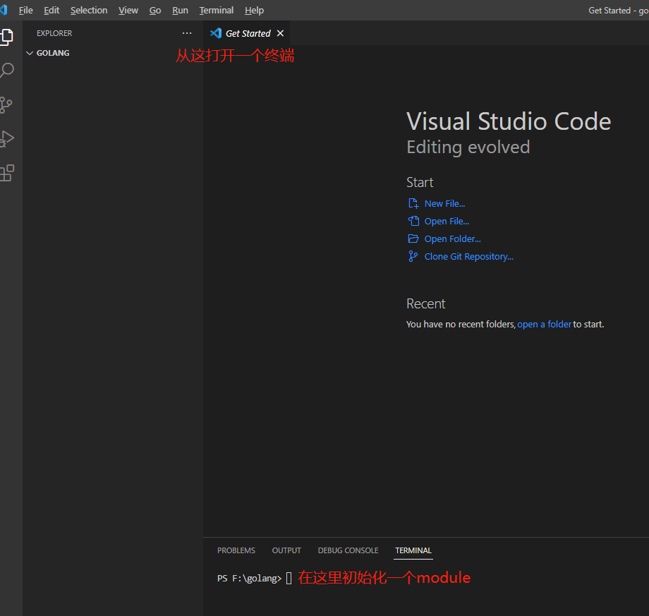
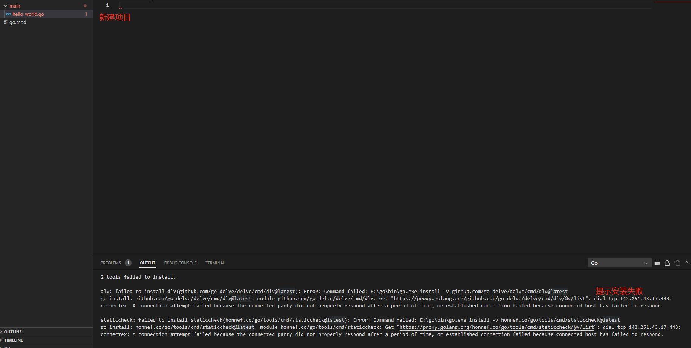
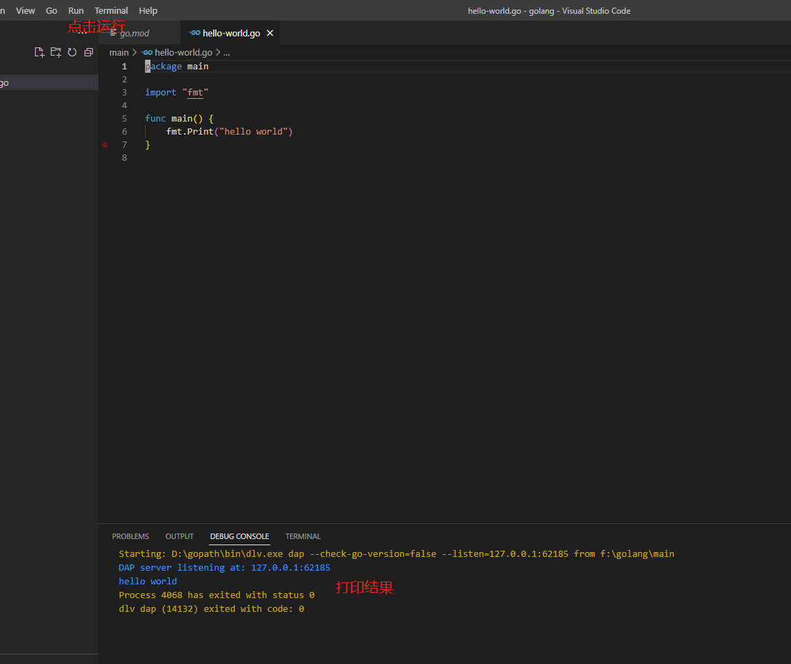

import Tabs from '@theme/Tabs';
import TabItem from '@theme/TabItem';

 编程语言的开发环境包含两部分：
1\. _IDE_，用什么工具开发。
2\. _SDK_，用什么编译和执行。

 _go_主流的_IDE_是_Goland_（和_Intellij_是一家）。当然也可以选择_VS code_、_Atom_等编辑器，通过安装插件的方式实现轻量级的_IDE_。_Goland_一年的授权费为_200_美金，第二年有优惠，有条件的朋友可以购买授权。笔者使用的是_VS code_，因为_go_团队为_VS code_开发了插件。

### 1. IDE下载

 前往[VS code官网](https://code.visualstudio.com/Download)，下载系统对应的安装程序。安装完成之后，前往[go插件地址](https://marketplace.visualstudio.com/items?itemName=golang.go)，点击下载会调起_VS code_进行插件安装。

### 2. SDK安装

 前往[go官网](https://go.dev/doc/install)下载系统对应的安装程序，安装完成之后，在命令行执行_go version_确定_go_的安装路径已经添加到系统路径里面了。

### 3. 设置代理

 因为网络封锁的原因，有一些_golang_的包无法下载，这时候需要设置代理。搭建代理可以参考[建站全攻略](/docs/set-up-site/your-site-in-one)。

<Tabs groupId="operating-systems">
  <TabItem value="win-cmd" label="Windows的CMD">
    打开<code>CMD</code>（注意是<code>CMD</code>，不是<code>PowerShell</code>）,执行以下命令： 
    <code>
      set http_proxy=http://127.0.0.1:10809  
      set https_proxy=http://127.0.0.1:10809  
      go install -v xxx
    </code>
  </TabItem>
  <TabItem value="win-power" label="Windows的PowerShell">
    打开<code>PowerShell</code>,执行以下命令： 
    <code>
      $ENV:HTTPS_PROXY='http://127.0.0.1:10809'  
      $ENV:HTTP_PROXY='http://127.0.0.1:10809'  
      go install -v xxx
    </code>
  </TabItem>
  <TabItem value="other" label="其他类unix系统">
  <code>
    http_proxy=127.0.0.1:10809 go install -v xxx
  </code>  
    &emsp;如果失败，可能需要<code>https</code>的代理。 
  <code>
    https_proxy=127.0.0.1:10809 go install -v xxx
  </code>
  </TabItem>
</Tabs>

### 4. 使用VS code

 _VS code_无法新建文件夹，所以需要手动新建一个_golang_的文件夹，然后从_VS code_里打开这个文件夹。接着打开终端，在终端执行初始化_module_的命令:

    go mod init hello-world

 在_go_文件夹下新建一个文件夹_main_，在_main_文件夹下新建_hello-world.go_，这个时候_VS code_会提示你有些插件没有安装，如果直接安装会失败，请使用代理试试。

### 5. 编写hello world

 和其他编程语言一样,_go_的入口函数也是_main_，接下来我们编写一个打印_hello world_的程序，并且运行。

    package main
    import "fmt"

    func main() {
    	fmt.Print("hello world")
    }

[署名-非商业性使用-禁止演绎 4.0 国际](https://creativecommons.org/licenses/by-nc-nd/4.0/deed.zh)
