import Tabs from '@theme/Tabs';
import TabItem from '@theme/TabItem';

> 说明：因中国大陆审查严格，故本攻略仅针对海外建站。

### 准备工作

 购买海外的云服务产品可能需要一张支持美元的信用卡，所以需要提前申请。

### 1. 服务器选择

 海外的服务器提供商主要有：`Google Cloud`、`Amazon AWS`、`Vultr`、`Digital Ocean`等。`Google Cloud`和`Amazon AWS`都提供免费试用的服务，但这两家产品都偏贵，而且网络传输并不免费，在试用的时候需要格外小心。

 个人建站推荐使用`Vultr`和`Digital Ocean`，这两家最便宜的服务器只需要`5$/月`。笔者使用比较多的是[`Vultr`](https://www.vultr.com/?ref=8912579)，新用户注册可以领取`100$`的体验券，但这张体验券有效期只有`1`个月，即最多白嫖一个月。

 在选择将服务器部署到哪个国家之前，需要对该国的网络进行测速。`ping test`的工具很多，例如[站长之家](https://ping.chinaz.com/)的`ping`工具。云服务器厂商提供了测试的`ip`，在`Google`上搜索`xxx ping test`就能搜到云厂商的测速页面，例如`Vultr`的[ping test](https://sgp-ping.vultr.com/)。你可以选择一个国家，获取到测试`ip`，然后用`ping`工具进行测试。从笔者使用情况看`Vultr`韩国的服务器比较好，国内的延迟大约`150ms`。

 接下来需要选择操作系统镜像，选择`Clound Compute`，这里面的套餐最低`5$/月`，同时包含了`1000G`的流量，个人站点足够了。笔者使用的是`Ubuntu`的镜像，因此本文基于`Ubuntu`进行编写的。
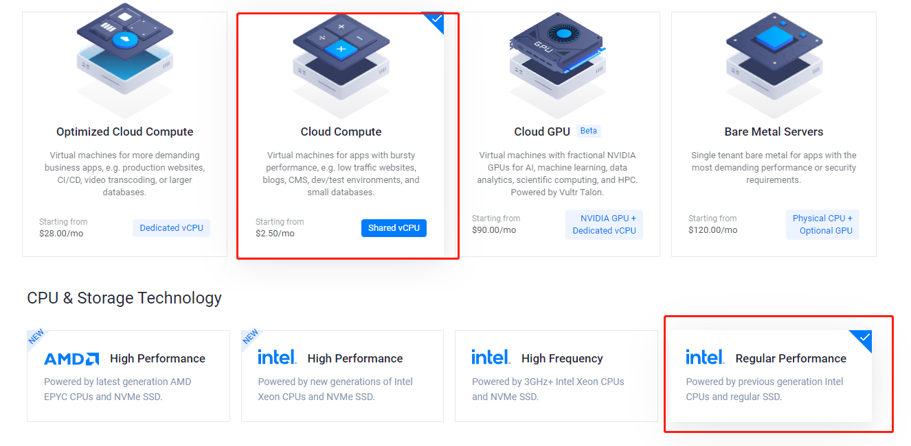

### 2. 登录服务器

 云服务器厂商提供了登录云服务器的工具，以`Vultr`为例，进入服务器实例详情，点击右上角`View Console`即可登录到服务器。当然你也可以使用`ssh`命令进行登录，在实例详情页面可以找到`ip`地址、端口以及密码。
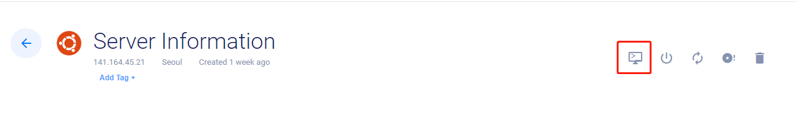

 如果是`windows`用户，可以安装`WinScp`这款工具，拷贝文件非常方便，同时也可以集成`putty`。

### 3. 安装nginx

 `nginx`是一款风靡全球的反向代理服务器，个人站点多数是静态站点，用`nginx`作为服务器非常方便。

    sudo apt-get install nginx

 安装完成之后，需要配置域名。以`linlan.xyz`为例，在`/etc/nginx/conf.d`目录下，新建`linlan.conf`，这个配置文件的内容非常简单：指定了端口号和域名。

    server {
            server_name linlan.xyz;
            listen 80;
    }

 接下来需要重启一下`nginx`，让`linlan.conf`配置生效。

    nginx -t //测试一下配置是否正常
    nginx -s reload //重启服务

### 4. 购买域名

 域名是我们站点的名字，海外有一些知名的域名供应商，例如[Godaddy](https://www.godaddy.com)、[Domain](https://www.domain.com/)、[NameSilo](https://www.namesilo.com/?rid=2ddf330gz)，推荐使用`NameSilo`，
`NameSilo`首年会有优惠，续费也没那么多套路，几十块一年，`DNS`解析不需要额外收费，并且支持支付宝付款。

#### 4.1 配置DNS

 购买域名后，需要将域名指向云服务器。在`NameSilo`的首页，点击右上角的`Manage Domain`（如下图)，进入到域名列表，找到你想要绑定的域名，点击`Manage DNS for this domain`，进入`DNS`配置页面。

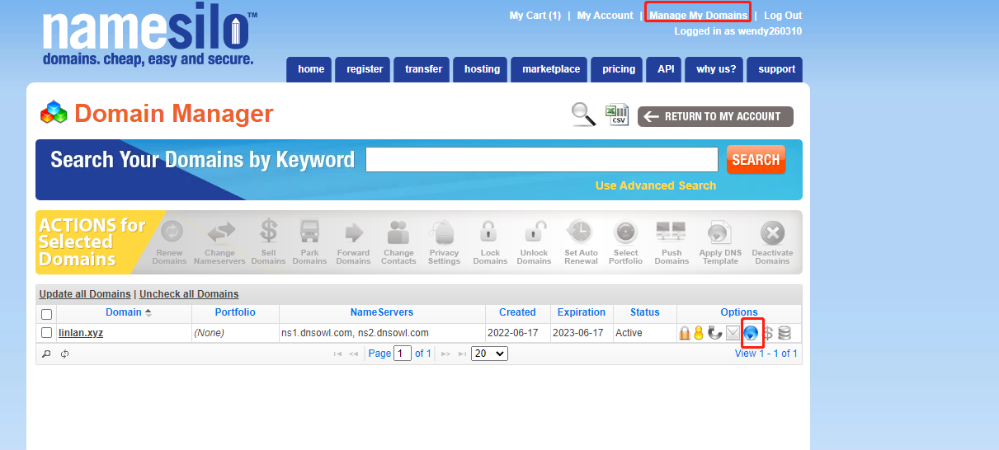

 以本站为例，`linlan.xyz`是一个二级域名，如果要让`linlan.xyz`指向购买的服务器，需要新建一个类型`A`的域名解析记录。`HostName`选`@.linlan.xyz`，`IP Address`填写云服务器对外的`IP`地址。`NameSilo`生效的时间比较长，需要等一会域名解析才能生效，使用`ping`命令可查看域名解析是否已经生效。

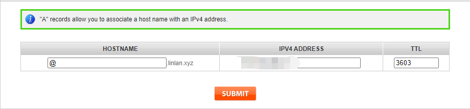

### 5. 检查服务器http和https端口

 域名解析生效之后，在浏览器输入购买的域名，就能够看到`nginx`的欢迎页面了。如果`ping`和`ssh`都正常，但是页面无法正常打开，这时需要检查服务器是否允许访问`80(http)`和`443(https)`端口。如果端口没有打开，可以通过下面命令开启，开启之后再测试一下页面是否能够正常访问。

    ufw status verbose //查看防火墙状态，确认端口是不是关闭
    sudo ufw allow 80 //打开80端口
    sudo ufw allow 443 //打开443端口

### 6. HTTPS证书申请

 `https`已经是站点的标配了，`Let’s Encrypt`提供免费的`https`证书，可以为你的站点申请一个。

#### 6.1 安装`Encrypt Client`

<Tabs groupId="operating-systems">
  <TabItem value="python2" label="python2"><code>sudo apt-get install certbot  apt-get install python-certbot-nginx</code></TabItem>
  <TabItem value="python3" label="python3"><code>sudo apt-get install certbot apt-get install python3-certbot-nginx</code></TabItem>
</Tabs>

#### 6.2 nginx配置（见章节3）

#### 6.3 生成证书

    sudo certbot --nginx -d example.com

 上述命令执行完成之后，你可以前往`/etc/nginx/conf.d`文件夹下，查看站点的配置。你会发现配置的内容被`cerbot`修改过，增加了`https`的内容。打开浏览器，使用`https`请求站点，确定`https`证书是否正确安装。

#### 6.4 刷新证书

 `Let's Encrypt`生成的证书有`90`的有效期，所以需要定时的刷新。

-   打开`crontab`

        crontab -e

-   新建自动刷新命令

        0 12 * * * /usr/bin/certbot renew --quiet

### 7. trojan安装

 `VPN`的协议有很多，`SS`、`Project V`和`Trojan`，笔者比较推荐`Trojan`，相对稳定，防干扰的能力出色。

    sudo bash -c "$(curl -fsSL https://raw.githubusercontent.com/trojan-gfw/trojan-quickstart/master/trojan-quickstart.sh)"

 `trojan`会监听`443`端口，如果不是`trojan`协议的流量，`trojan`会将请求转发到`80`端口，故`nginx`需关掉`https`的端口，只需将章节`6`中`cerbot`增加的`https`内容去掉即可，但需要记录证书和`key`的路径，这两个配置项在配置`trojan`的时候需要用到。

    server {
            server_name linlan.xyz;
            listen 80;
    }

 修改完`nginx`的配置文件之后，重启一下`nginx`。打开`trojan`的配置文件，`Ubuntu`下路径为`/usr/local/etc/trojan/config.json`，修改三个地方：密码，`cert`和`key`。

    {
        "run_type": "server",
        "local_addr": "0.0.0.0",
        "local_port": 443,
        "remote_addr": "127.0.0.1",
        "remote_port": 80,
        "password": [
            "设置一个访问trojan的密码"
        ],
        "log_level": 1,
        "ssl": {
            "cert": "你申请的证书",
            "key": "证书的key",
            "key_password": "",
            "cipher": "ECDHE-ECDSA-AES128-GCM-SHA256:ECDHE-RSA-AES128-GCM-SHA256:ECDHE-ECDSA-AES256-GCM-SHA384:ECDHE-RSA-AES256-GCM-SHA384:ECDHE-ECDSA-CHACHA20-POLY1305:ECDHE-RSA-CHACHA20-POLY1305:DHE-RSA-AES128-GCM-SHA256:DHE-RSA-AES256-GCM-SHA384",
            "cipher_tls13": "TLS_AES_128_GCM_SHA256:TLS_CHACHA20_POLY1305_SHA256:TLS_AES_256_GCM_SHA384",
            "prefer_server_cipher": true,
            "alpn": [
                "http/1.1"
            ],
            "alpn_port_override": {
                "h2": 81
            },
            "reuse_session": true,
            "session_ticket": false,
            "session_timeout": 600,
            "plain_http_response": "",
            "curves": "",
            "dhparam": ""
        },
        "tcp": {
            "prefer_ipv4": false,
            "no_delay": true,
            "keep_alive": true,
            "reuse_port": false,
            "fast_open": false,
            "fast_open_qlen": 20
        },
        "mysql": {
            "enabled": false,
            "server_addr": "127.0.0.1",
            "server_port": 3306,
            "database": "trojan",
            "username": "trojan",
            "password": "",
            "key": "",
            "cert": "",
            "ca": ""
        }
    }

 `trojan`的配置修改完之后，启动`trojan`服务即可。

    trojan /usr/local/etc/trojan/config.json &

 接下来是`trojan`客户端，有很多客户端支持`trojan`协议，这里笔者使用的是[Project V](https://www.v2ray.com/en/awesome/tools.html)的客户端，它既支持`Project V`的协议，也支持`trojan`的协议，配置如下图。
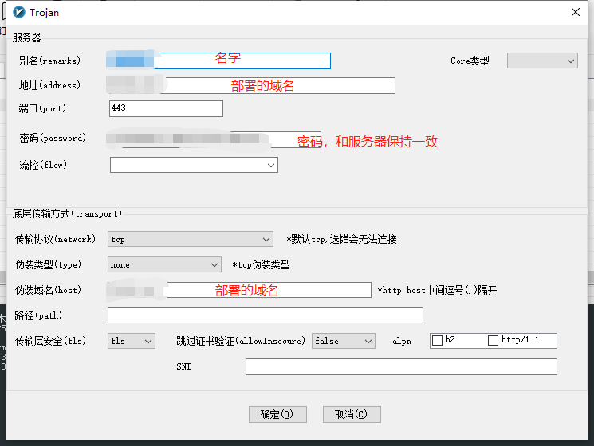

 最后就是在`Chrome`上安装大名鼎鼎的`SwitchyOmega`插件，`SwitchyOmega`目前不能直接从`Chrome`的应用商店安装了，即使手动下载`crx`文件，拖动到`Chrome`里面也会报错。需用`zip`解压工具对`crx`文件进行解压，得到一个插件目录，打开`Chrome`的开发者模式进行加载即可。
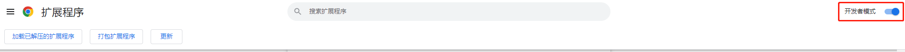

 现在的网络请求是这样中转的：`Chrome` ->  `trojan`客户端 ->  `trojan`服务端 -> 你想访问的网站。当然`trojan`客户端会过滤掉未被屏蔽的网站，这样速度会快很多。

 接着介绍一下，`SwitchyOmega`如何配置。点击`SwitchyOmega`插件，进入选项界面，新建一个情景模式，参考下图进行配置。如果不知道`trojan`客户端监听的端口号，可以在`trojan`客户端主界面的左下角找到。
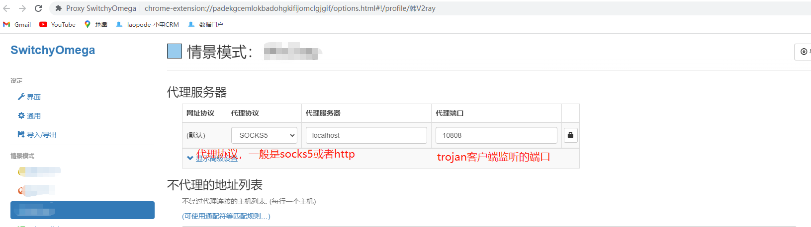
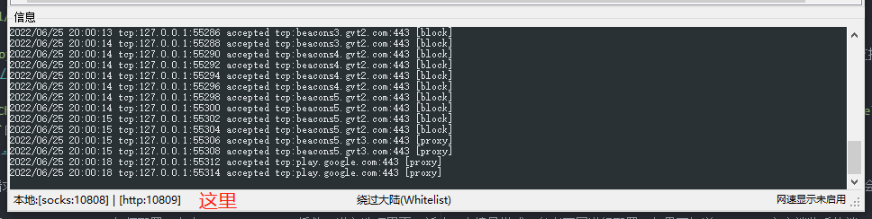

### 8. 搭建站点

 市面上建站的开源框架非常的多，有[Hexo](https://hexo.io/docs/writing.html)、[Jekyll](https://github.com/jekyll/jekyll)、[WordPress](https://wordpress.com/)等，本站点使用的是`Facebook`开源的[docusaurus](https://docusaurus.io/)，有兴趣的朋友可以移步到[docusaurus使用全攻略](/docs/docusaurus/docusaurus-intro)，学习如何使用`docusaurus`搭建站点。

### 9. 发布站点

 上面提到的建站框架支持生成静态站点，编译之后放到`nginx`对应的目录下即可。以`docusaurus`为例，执行`npm run build`之后，在项目根目录下会生成一个`build`文件夹，通过上面介绍的`WinScp`工具非常方便的拷贝到服务器上。
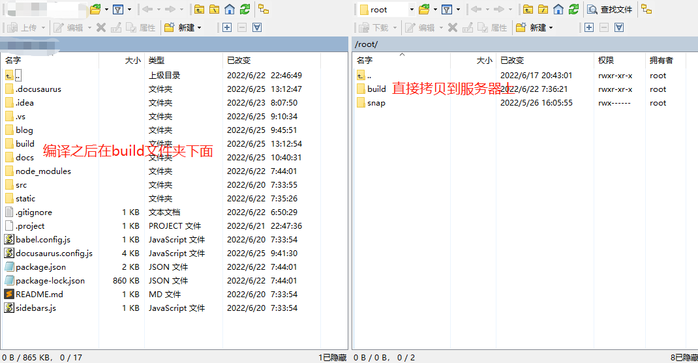

 对应站点的`nginx`文件也需求进行修改，修改完成后，重启`nginx`。

    server {
            server_name linlan.xyz;
            listen 80;
            root /root/build/; 拷贝到服务器的目录
            rewrite  ^/$  https://$server_name/index.html permanent;
    }

### 10. 接入Google Search和Google gtag

 对于一个站点，接入`Google Search`和`Google gtag`是必不可少的。`Google Search`可以让你的站点出现在`Google`的搜索结果中，`Google gtag`可以记录你的页面访问情况。

#### 10.1 Google Search接入

 登录到[Google Search](https://search.google.com/)之后，点击左上角的添加新资源，会跳出一个对话框。选择后面的`URL`的方式，这个时候会提示验证站点。验证的方式非常简单，下载一个`html`文件，将这个文件放到你站点根目录下（在本文的例子中，就是放在`build`目录下）即可。因为从本地拷贝`build`文件夹到服务器上时，可能会覆盖掉服务器上的`build`目录，导致这个`html`文件丢失，所以建议将这个`html`文件直接打包到你的站点文件里。

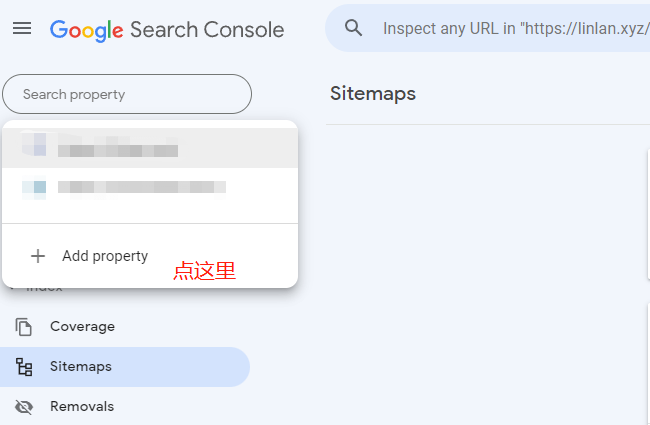

 搜索引擎使用`sitemap`来发现站点里面的页面。建站框架提供了`sitemap`生成工具，默认会放到站点的根目录下。例如：`https://linlan.xyz/sitemap.xml`。

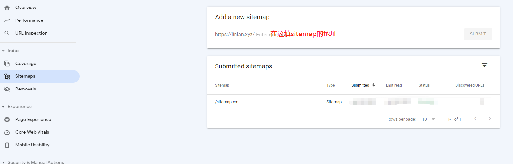

#### 10.2 Google gtag接入

 登录到[Google analytics](https://analytics.google.com/)，点击左下角的齿轮，进入设置页面。如果没有账户，先创建账户，接着创建资源，按照页面的指引下一步即可。最后得到一个`gtag id`。

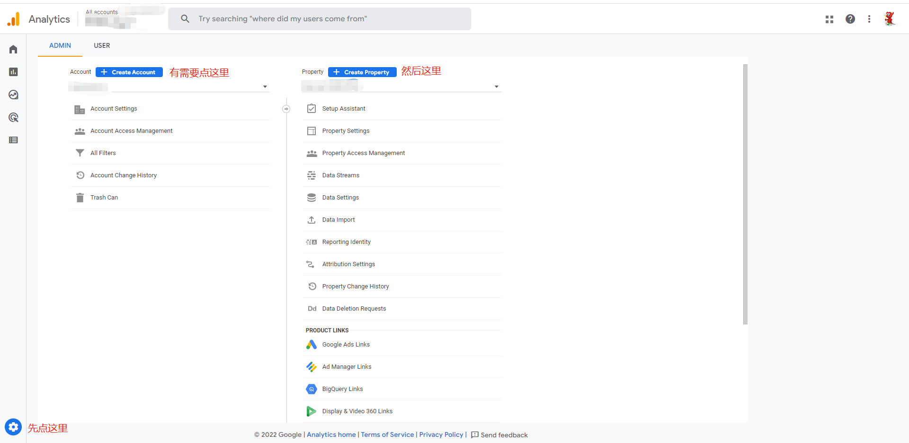

 `gtag`实际对应一段`js`代码，将这段代码放在站点的`head`标签里面即可，下面代码是例子。拷贝时记得将里面的`gtag id`换成你申请的`gtag id`。有些框架（例如`docusaurus`、`hexo`等）集成了`gtag`，只需要在配置文件里面修改`gtag id`即可。

    <!-- Global site tag (gtag.js) - Google Analytics -->
    
    

 至此，你也拥有了自己的站点了，接下来就尽情的创作吧！

[署名-非商业性使用-禁止演绎 4.0 国际](https://creativecommons.org/licenses/by-nc-nd/4.0/deed.zh)
